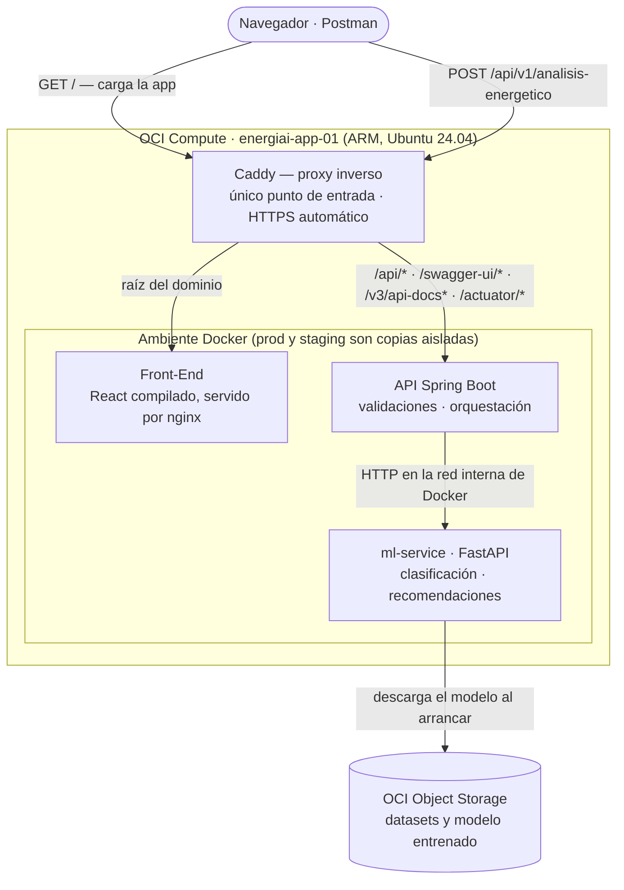
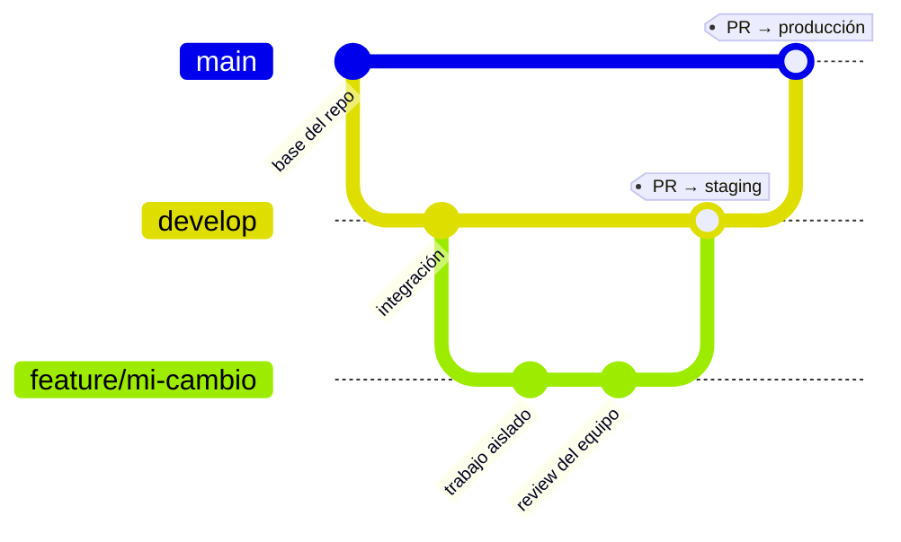

<div align="center">

# ⚡ EnergiAI – Inteligencia para el Consumo Energético

### Hackathon ONE — G9 | Alura + Oracle | LATAM


</div>

---

## 📌 Descripción del Proyecto

### El Problema

Millones de hogares y pequeñas empresas reciben mensualmente facturas de energía elevadas **sin entender qué hábitos las generan**. La falta de visibilidad sobre el propio consumo eléctrico impide tomar decisiones informadas, genera desperdicios evitables y aumenta innecesariamente el gasto familiar y operativo.

### La Solución

**Analizador Inteligente de Eficiencia Energética** es un MVP que convierte datos crudos de consumo eléctrico en información accionable. La solución recibe información del consumo de una vivienda o pequeño establecimiento (kWh mensuales, horarios de uso, cantidad de equipos, tipo de inmueble) y entrega:

- 🔍 **Clasificación del perfil energético** mediante Machine Learning (`Eficiente`, `Moderado`, `Ineficiente`).
- 💡 **Recomendaciones personalizadas** para reducir desperdicios y adoptar hábitos más sostenibles.
- 💰 **Estimación del costo mensual** basada en la tarifa de referencia estándar (**$0.75 / kWh**).
- 📊 Resultados entregados vía **API REST en formato JSON**, listos para integrarse con cualquier sistema o aplicación front-end.

---

## 📚 Documentación

Este README es el punto de entrada. El detalle de cada área vive en [`docs/`](./docs/README.md):

| Área | Qué encontrar ahí |
|------|-------------------|
| [📅 Avances Semanales](./docs/avances/README.md) | Seguimiento del progreso por sprint |
| [🏛️ Arquitectura](./docs/architecture/README.md) | Diagramas del sistema, flujo de datos y decisiones de integración |
| [☕ Back-End](./docs/backend/README.md) | Contrato de la API, Swagger y endpoints |
| [🖥️ Front-End](./docs/frontend/README.md) | Arquitectura de la aplicación, decisiones de despliegue e informes por sprint |
| [🐍 Data Science](./docs/data-science/README.md) | EDA, modelos y métricas |
| [☁️ OCI Cloud](./docs/oci-cloud/README.md) | Red, VM, dominios, Object Storage y runbook |
| [⚙️ Gobernanza & GitHub](./docs/github-config.md) | Protección de ramas, GitFlow y flujo de CI/CD |

---

## 🛠️ Stack Tecnológico y Estrategia de Integración

El proyecto se divide en tres áreas: Front-End (TypeScript), Back-End (Java) y Data Science (Python).

| Capa | Tecnología | Rol |
|------|-----------|-----|
| **Front-End** | Vite / React 19 / TypeScript | Interfaz de ingreso de datos y presentación del resultado. Compila a estáticos, servidos por nginx. |
| **Back-End** | Java 17+ / Spring Boot 4.0.7 | API REST principal, orquestación y validaciones. |
| **Data Science** | Python 3.10+ / Pandas / Scikit-Learn | Análisis de datos (EDA), entrenamiento del modelo ML y servicio de inferencia (FastAPI). |
| **Infraestructura** | Oracle Cloud (OCI) + Docker + Caddy | Almacenamiento (Object Storage), despliegue (Compute) y proxy inverso con HTTPS. |

### Integración Python ↔ Java

Se evaluaron dos alternativas:

- **Alternativa A (Microservicios)** — el modelo Python expuesto como API independiente con **FastAPI**, invocada por el back-end vía HTTP dentro de la red interna de Docker.
- **Alternativa B (Embebido)** — exportar el modelo a **ONNX** y ejecutarlo dentro de la aplicación Spring Boot.

> ✅ **Implementada: la alternativa A.** El back-end llama al `ml-service` a través de [`MlClient`](./backend/analisis-energetico-api/src/main/java/com/energiai/client/MlClient.java), con la URL y los timeouts configurados en `application.properties` (`ml.service.url`, por defecto `http://localhost:8000`). La alternativa B queda registrada como opción descartada, no como decisión pendiente.

---

## 📐 Arquitectura de la Solución (MVP)



**Cómo leerlo:**

- **Caddy es el único punto de entrada.** Rutea por path con el patrón *same-origin*: la raíz sirve el front-end y `/api/*` va al back-end. Como la interfaz y la API comparten dominio, **la aplicación no necesita CORS**.
- **La llamada al ML nunca sale de la VM**: viaja contenedor a contenedor por la red interna de Docker, sin pasar por el proxy ni por internet.
- **Producción y staging son copias completas del stack**, aisladas en proyectos de Compose distintos sobre la misma VM.

> Detalle de la infraestructura (red, firewall, dominios, runbook) en [`docs/oci-cloud/`](./docs/oci-cloud/README.md); decisiones de arquitectura en [`docs/architecture/`](./docs/architecture/README.md).

---

## 🔌 Contrato de Datos Unificado (API REST)

### Endpoint Principal

```
POST /api/v1/analisis-energetico
Content-Type: application/json
```

### Request Body

```json
{
"consumo_kwh": 450.5,
"cantidad_equipos": 8,
"tipo_inmueble": "Casa",
"uso_horario_pico": true,
"horas_alto_consumo": 6,
"metros_cuadrados": 30,
"antiguedad_vivienda": 34,
"zona_fria": false,
"calidad_aislamiento": "Media",
"fuente_calefaccion": "Solar",
"fuente_agua_caliente": "Electricidad"
}
```

### Response Body (HTTP 200 OK)

```json
{
"categoria": "Moderado",
"probabilidad": 0.65,
"costo_estimado_mensual": 337.88,
"recomendaciones": [
"Consumo moderado.",
"Optimizar el uso de aire acondicionado.",
"Desconectar equipos eléctricos en modo Stand-by.",
"Considerar iluminación LED."
]
}
```
> Nota: los valores de Response Body son ilustrativos 

---

## 📋 Validaciones del DTO (Reglas de Entrada)

| Campo | Tipo | Obligatorio | Restricciones |
|-------|------|:-----------:|---------------|
| `consumo_kwh` | `Double` | ✅ | Debe ser **1 ≤ valor ≤ 1000** |
| `uso_horario_pico` | `Boolean` | Opcional | `true` o `false` |
| `cantidad_equipos` | `Integer` | ✅ | Debe ser **1 ≤ valor ≤ 100** |
| `tipo_inmueble` | `String (Enum)` | ✅ | Solo valores: `Casa`, `Departamento`, `Comercio`, `Pyme` |
| `horas_alto_consumo` | `Integer` | ✅ | Rango: **0 ≤ valor ≤ 24** |
| `metros_cuadrados` | `Integer` | Opcional | Rango: **26 ≤ valor ≤ 2000** |
| `antiguedad_vivienda` | `Integer` | Opcional | Rango: **0 ≤ valor ≤ 150** |
| `zona_fria` | `Boolean` | Opcional | `true o false` |
| `calidad_aislamiento` | `String (Enum)` | Opcional | `Muy Alta`, `Alta`, `Media`, `Baja`, `Muy Baja` |
| `fuente_calefaccion` | `String (Enum)` | Opcional | Solo valores: `Solar`, `Electricidad`, `Otros` |
| `fuente_agua_caliente` | `String (Enum)` | Opcional | Solo valores: `Solar`, `Electricidad`, `Otros` |
---

> Nota: la obligatoriedad definitiva de los campos incorporados en la versión 1.2 se encuentra pendiente de definición funcional. Actualmente, el DTO de Spring Boot utiliza @NotNull en los 11 campos, por lo que la implementación vigente exige su envío. El código deberá ajustarse cuando se congele el contrato definitivo.

## 🌐 Configuración de Puertos y Red

| Servicio | Puerto Local | Puerto Producción (OCI) |
|----------|:------------:|:-----------------------:|
| Proxy inverso (Caddy) | — | `80` / `443` — los únicos puertos abiertos al exterior |
| API Spring Boot | `8080` | `443` (HTTPS) vía proxy inverso |
| Front-End (nginx, contenedor) | `3000` | raíz del dominio vía proxy (same-origin) |
| Front-End (`npm run dev`, sin Docker) | `5173` | — solo desarrollo local |
| Microservicio ML / FastAPI | `8000` | interno (solo red Docker) |

> Los puertos de los contenedores se publican en `127.0.0.1`, no en `0.0.0.0`: desde afuera de la VM **solo** se llega a través del proxy. Staging corre en paralelo con los suyos (ver [CI/CD](#-ci--cd)).

---

## 📖 Documentación Interactiva de la API

Una vez levantado el back-end, la documentación estará accesible en:

| Herramienta | URL Local |
|-------------|-----------|
| **Swagger UI** (interfaz visual) | `http://localhost:8080/swagger-ui.html` |
| **OpenAPI JSON** (spec completa) | `http://localhost:8080/v3/api-docs` |
| **Health check** (Actuator) | `http://localhost:8080/actuator/health` |

> 💡 **Nota sobre buenas prácticas en Producción:** 
> Durante la fase de desarrollo local se mantiene la ruta estándar de Swagger UI (`/swagger-ui.html`). Al momento de desplegar en producción, como buena práctica, se puede configurar una ruta más limpia (ej. `/docs`), proteger el acceso mediante autenticación o incluso deshabilitar Swagger completamente por motivos de seguridad.

---

## 🌿 Estrategia de Ramas (Git Workflow)



El diagrama muestra el **flujo esperado**, no las ramas que existen hoy: `feature/mi-cambio` es un ejemplo. Cada rama tiene un destino de despliegue — **un merge no es solo un merge, es un deploy**.

| Rama | Rol | Al mergear se despliega en |
|------|-----|---------------------------|
| `feature/*` · `fix/*` · `chore/*` | Trabajo aislado de una persona o tema | — (solo corre el CI) |
| `develop` | Integración del equipo | **Staging** — `energiai-staging.unixsoluciones.com` |
| `main` | Producción / evaluación del Hackathon (protegida) | **Producción** — `energiai.unixsoluciones.com` |

**Convención de nombres:** `<tipo>/<tema-en-kebab-case>` — `feature/` para funcionalidad nueva, `fix/` para correcciones, `chore/` para mantenimiento. El tema describe el cambio, no a la persona: `feature/dto-validation`, no `feature/juan-2`.

> [!IMPORTANT]
> 1. **Nunca hacer push directo a `main`** — Solo mediante Pull Request desde `develop`.
> 2. **Nunca hacer push directo a `develop`** — Solo mediante Pull Request desde `feature/*`.

---

## 🚀 Instrucciones de Ejecución Local

### Prerrequisitos
- Java 17+ y Maven 3.8+
- Python 3.10+
- Docker Desktop

### 1. Clonar el repositorio
```bash
git clone https://github.com/No-Country-simulation/G9-LATAM-TEAM-09.git
cd G9-LATAM-TEAM-09
```

### 2. Ejecutar con Docker Compose (Recomendado)
Para levantar todos los servicios de forma orquestada:
```bash
docker compose up --build -d
```

### 3. Ejecutar servicios individualmente (Modo Desarrollo)
**Para el Backend (Java):**
```bash
cd backend
./mvnw spring-boot:run
```
**Para el servicio de Machine Learning (Si se usa la Alternativa A):**
```bash
cd data-science/raw
python -m pip install -r requirements.txt
python -m uvicorn interfaces.api.app:app --reload --port 8000
```

---

## 💡 Ejemplos de Uso

### Perfil de prueba orientado a Eficiente
```json
{
  "consumo_kwh": 200,
  "cantidad_equipos": 6,
  "tipo_inmueble": "Casa",
  "uso_horario_pico": false,
  "horas_alto_consumo": 6,
  "metros_cuadrados": 26,
  "antiguedad_vivienda": 2,
  "zona_fria": false,
  "calidad_aislamiento": "Alta",
  "fuente_calefaccion": "Solar",
  "fuente_agua_caliente": "Solar"
}
```
### Perfil de prueba orientado a Moderado
```json
{
  "consumo_kwh": 300,
  "cantidad_equipos": 8,
  "tipo_inmueble": "Departamento",
  "uso_horario_pico": true,
  "horas_alto_consumo": 3,
  "metros_cuadrados": 35,
  "antiguedad_vivienda": 7,
  "zona_fria": false,
  "calidad_aislamiento": "Media",
  "fuente_calefaccion": "Electricidad",
  "fuente_agua_caliente": "Electricidad"
}
```
### Perfil de prueba orientado a Ineficiente
```json
{
  "consumo_kwh": 600,
  "cantidad_equipos": 10,
  "tipo_inmueble": "Departamento",
  "uso_horario_pico": true,
  "horas_alto_consumo": 6,
  "metros_cuadrados": 40,
  "antiguedad_vivienda": 15,
  "zona_fria": true,
  "calidad_aislamiento": "Baja",
  "fuente_calefaccion": "Electricidad",
  "fuente_agua_caliente": "Electricidad"
}
```

---

## ☁️ Integración con OCI (Oracle Cloud Infrastructure)

| Servicio OCI | Uso en el Proyecto | Estado |
|-------------|-------------------|--------|
| **OCI Compute** | VM ARM64 con los dos ambientes (producción y staging) detrás de proxy con HTTPS. | infraestructura preparada; despliegue integral pendiente. |
| **OCI Object Storage** | Almacenamiento del modelo serializado (`.joblib`) y datasets de entrenamiento. | integración implementada y validada via PAR. |

Detalle completo de la infraestructura (red, VM, dominios, seguridad, runbook): [`docs/oci-cloud/`](docs/oci-cloud/README.md).

### Modos de acceso al Object Storage

El microservicio ML soporta tres backends de storage, seleccionables con la variable `STORAGE_BACKEND`:

| `STORAGE_BACKEND` | Descripción | Variables requeridas |
|:-----------------:|-------------|---------------------|
| `local` *(default)* | Filesystem local. Para dev, CI y tests. No necesita credenciales. | — |
| `par` ⭐ **Recomendado en producción** | Acceso via **Pre-Authenticated Request URL** de OCI. Sin SDK, sin credenciales, solo HTTP. | `OCI_PAR_URL` |
| `oci` | SDK oficial de OCI con auth por Instance Principal, config file o API key. | `OCI_NAMESPACE`, `OCI_BUCKET`, `OCI_REGION` + auth |

### Configurar acceso PAR en la VM (producción)

Crear o completar el archivo `.env` en el directorio de trabajo del runner:

```bash
# .env en la VM de OCI (directorio del runner de GitHub Actions)
STORAGE_BACKEND=par
OCI_PAR_URL=https://objectstorage.sa-santiago-1.oraclecloud.com/p/<token>/b/g9-energy-test-bucket/o
```

> ⚠️ `OCI_PAR_URL` contiene el token de autenticación embebido. Tratarla como secreto — no commitear en el repositorio.

> 📁 El servicio busca el modelo en `latest/modelo_eficiencia_v1.joblib` dentro del bucket. Verificar que ese path sea accesible con el PAR antes de hacer deploy.

---

## 🔄 CI / CD

El proyecto tiene **4 workflows** en `.github/workflows/`:

| Workflow | Trigger | Runner | Descripción |
|----------|---------|--------|-------------|
| `ci.yml` | Push / PR a `main`, `develop` | `ubuntu-latest` (GitHub hosted) | Build + tests de los 3 componentes. Valida que el código compile y los tests pasen antes de mergear. |
| `cd-backend.yml` | Push a `main`/`develop` en `backend/**` | `self-hosted, oci` | Construye la imagen Docker del backend, la despliega en la VM y verifica `/actuator/health`. Rollback automático si falla. |
| `cd-ml.yml` | Push a `main`/`develop` en `data-science/**` | `self-hosted, oci` | Construye la imagen Docker del ML service, la despliega y verifica `/health`. Rollback automático si falla. |
| `cd-frontend.yml` | Push a `main`/`develop` en `frontend/**` | `self-hosted, oci` | Construye y despliega el frontend (nginx). Rollback automático si falla. |

### Ambientes

| Ambiente | Rama | Proyecto Compose | Puertos |
|----------|------|-----------------|--------|
| **Staging** | `develop` | `energiai-staging` | Backend: 8081 · ML: 8002 · Frontend: 3001 |
| **Producción** | `main` | `energiai-prod` | Backend: 8080 · ML: 8000 · Frontend: 3000 |

### Rollback manual

Cada CD registra el SHA de la versión anterior. Para revertir:
1. Ir a **Actions** → workflow correspondiente → **Run workflow**.
2. Seleccionar el ambiente y pegar el SHA de la versión anterior en el campo `tag`.

### Requisitos del runner self-hosted

El runner en la VM debe tener un archivo `.env` en su directorio de trabajo con:

```bash
STORAGE_BACKEND=par                   # o 'oci' si se usa el SDK
OCI_PAR_URL=https://objectstorage...  # solo si STORAGE_BACKEND=par
# OCI_NAMESPACE=...                   # solo si STORAGE_BACKEND=oci
```

Los CDs validan la presencia del `.env` y de las variables requeridas según el backend configurado **antes** de hacer `docker compose up`, fallando con un mensaje claro si faltan.

---

## 👥 Equipo G9 — LATAM TEAM 09

| Nombre | Rol | Área |
|--------|-----|------|
| **Constanza Albornoz** | Data Analyst | Data Science |
| **Leandro Ariel Moreno** | Backend Developer | Back-End Java |
| **Alan Federico Cabrera** | Backend Developer | Back-End Java |
| **Nahuel Rosas** | Data Scientist | Data Science / ML |
| **Marco Antonio Soto Bobadilla** | Project Manager | Gestión del Proyecto |
| **Randy Roco Mellado** | Data Engineer | Data Engineering / OCI |
| **Lautaro Sebastian Mambrin** | Full Stack Developer | Back-End + Front-End opcional |
| **Sergio Villena** | Software Engineer | Arquitectura / DevOps |

---

## 📄 Licencia

Este proyecto está bajo la licencia **MIT**. Ver el archivo `LICENSE` para más detalles.

---

<div align="center">

**Hackathon ONE — G9 LATAM TEAM 09**

*Alura + Oracle | 2026*

[](https://alura-es-cursos.github.io/proyectos-hackathon-g9-latam/)

</div>
