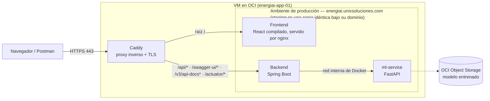

# 🏛️ Documentación de Arquitectura de la Solución

## 📌 Resumen
Cómo está armada la solución y cómo fluye una request de punta a punta: del navegador al proxy, del proxy al frontend o a la API según el path, y de la API al modelo de ML.

---

## 📐 Diagrama de Arquitectura (MVP)

**Cómo leerlo:**

- **Caddy es el único punto de entrada** (HTTPS con certificados automáticos). Rutea con el patrón *same-origin*: la raíz del dominio sirve el frontend y `/api/*` va al backend — mismo origen, **sin CORS para la app**. Swagger, la spec OpenAPI y Actuator necesitan sus propias reglas: sin ellas caerían en la regla de la raíz y las serviría el frontend.
- La flecha **"red interna de Docker"** es la llamada del backend al ml-service **dentro de la VM**, contenedor a contenedor (`ml.service.url` ← `ML_SERVICE_URL`, definido en [`docker-compose.yml`](../../docker-compose.yml)): nunca sale a internet ni pasa por el proxy. La invocación existe en el código desde el 05/08 — [`MlClient`](../../backend/analisis-energetico-api/src/main/java/com/energiai/client/MlClient.java) —, así que ya no es una integración proyectada.
- **Staging es una copia idéntica** de todo el stack bajo `energiai-staging.unixsoluciones.com`, aislada en su propio proyecto de compose.

---

## 🧩 Componentes

| Componente | Tecnología | Estado |
|------------|------------|--------|
| Frontend | Vite · React 19 · TypeScript (compilado y servido por nginx) | ✅ Desplegado en los dos ambientes |
| API Backend | Java 17 · Spring Boot | ✅ En `develop` — `POST /api/v1/analisis-energetico` |
| ml-service | Python 3.10 · FastAPI | ✅ En `develop` ([`data-science/`](../../data-science)) y desplegado |
| Modelo ML | scikit-learn → `.pkl` | ✅ Entrenado y cargado desde Object Storage al arrancar el servicio |
| Proxy inverso | Caddy (nativo en la VM) | ✅ Activo con HTTPS |

Los tres componentes están desplegados y responden. El flujo completo punta a punta —formulario → API → modelo → resultado— sigue **en integración**: el detalle de lo que falta está en el [informe de la Semana 3](../frontend/semanas/semana-3/informe.md).

---

## 🔗 Integración Java ↔ Python

- ✅ **Alternativa A (Microservicios) — la implementada.** El modelo Python corre como API interna con FastAPI y el backend Java la llama por HTTP dentro de la red de Docker, vía [`MlClient`](../../backend/analisis-energetico-api/src/main/java/com/energiai/client/MlClient.java). Es lo que reflejan el [`docker-compose.yml`](../../docker-compose.yml) y el diagrama de arriba.
- **Alternativa B (Embebido)** — exportar el modelo a **ONNX** y ejecutarlo dentro de la aplicación Spring Boot. Queda registrada como opción descartada; si algún día se retomara, la caja `ml-service` desaparecería del diagrama.

---

## 🌍 Ambientes

| Ambiente | URL | Rama asociada |
|----------|-----|---------------|
| Producción | `https://energiai.unixsoluciones.com` | `main` |
| Staging | `https://energiai-staging.unixsoluciones.com` | `develop` |

Ambos dominios sirven la aplicación con HTTPS válido desde el **09/08** — hasta esa fecha respondían 502, con el proxy vivo pero sin app detrás. Cada push a `develop` o `main` redespliega el componente que cambió (ver [CI/CD](../../README.md#-ci--cd)). El detalle de la infraestructura que sostiene todo esto (VM, red, firewall, dominios, runbook) está en [`docs/oci-cloud/`](../oci-cloud/README.md).

---

## 🖼️ Archivos y Capturas (`assets/`)
Los diagramas van embebidos en mermaid (GitHub los renderiza nativo). Guarde diagramas C4 o imágenes explicativas adicionales en `docs/architecture/assets/`.
