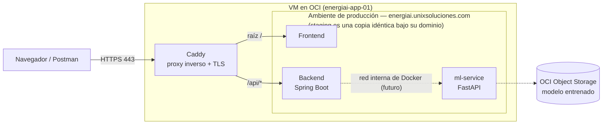

# 🏛️ Documentación de Arquitectura de la Solución

## 📌 Resumen
Cómo está armada la solución y cómo fluye una request de punta a punta: del navegador al proxy, del proxy al frontend o a la API según el path, y de la API al modelo de ML.

---

## 📐 Diagrama de Arquitectura (MVP)

**Cómo leerlo:**

- **Caddy es el único punto de entrada** (HTTPS con certificados automáticos). Rutea con el patrón *same-origin*: la raíz del dominio sirve el frontend y `/api/*` va al backend — mismo origen, **sin CORS para la app**. Mientras el frontend esté en desarrollo, el dominio va directo a la API.
- La flecha **"red interna de Docker (futuro)"** es la llamada del backend al ml-service **dentro de la VM**, contenedor a contenedor (`ML_SERVICE_URL`, ya definido en [`docker-compose.yml`](../../docker-compose.yml)): nunca sale a internet ni pasa por el proxy. Es "futuro" porque hoy el backend todavía no invoca al ml-service — la clasificación es lógica provisional por umbrales.
- **Staging es una copia idéntica** de todo el stack bajo `energiai-staging.unixsoluciones.com`, aislada en su propio proyecto de compose.

---

## 🧩 Componentes

| Componente | Tecnología | Estado |
|------------|------------|--------|
| Frontend | Por definir (servido en la raíz del dominio vía proxy) | 🔜 En desarrollo |
| API Backend | Java 17 · Spring Boot | ✅ En `develop` — `POST /api/v1/analisis-energetico` |
| ml-service | Python 3.10 · FastAPI | ⏳ En la rama `data`, pendiente de merge |
| Modelo ML | scikit-learn → `.pkl` / `.onnx` | ⏳ Dataset y modelo en preparación (data-science) |
| Proxy inverso | Caddy (nativo en la VM) | ✅ Activo con HTTPS |

---

## 🔗 Integración Java ↔ Python (decisión pendiente)

- **Alternativa A (Microservicios)** — el modelo Python como API interna con FastAPI; el backend Java la llama por HTTP dentro de la red de Docker. Es la que refleja el [`docker-compose.yml`](../../docker-compose.yml) actual y el diagrama de arriba.
- **Alternativa B (Embebido)** — exportar el modelo a **ONNX** y ejecutarlo dentro de la aplicación Spring Boot. Si se elige, la caja `ml-service` desaparece del diagrama y el modelo corre en el backend.

---

## 🌍 Ambientes

| Ambiente | URL | Rama asociada |
|----------|-----|---------------|
| Producción | `https://energiai.unixsoluciones.com` | `main` |
| Staging | `https://energiai-staging.unixsoluciones.com` | `develop` |

Aún sin primer deploy: los dominios responden **502 (esperado)** — el proxy está vivo, todavía no hay app detrás. El detalle de la infraestructura que sostiene todo esto (VM, red, firewall, dominios, runbook) está en [`docs/oci-cloud/`](../oci-cloud/README.md).

---

## 🖼️ Archivos y Capturas (`assets/`)
Los diagramas van embebidos en mermaid (GitHub los renderiza nativo). Guarde diagramas C4 o imágenes explicativas adicionales en `docs/architecture/assets/`.
