# EnergiAI — Documentación de Pruebas Automatizadas

Este documento detalla el proceso de ejecución de la batería de pruebas automatizadas para la API REST de EnergiAI. Se ha utilizado una colección personalizada de Postman para validar el comportamiento del sistema en un entorno de *staging*/clonado, garantizando que no se afecte la base de datos ni los servicios de producción.

---

## 1. Contexto del Proyecto

Para asegurar la estabilidad de la aplicación, se ha clonado el entorno de producción y se han ejecutado los siguientes tipos de pruebas:

| Tipo de Prueba | Descripción |
|---|---|
| **Health Checks** | Verificación de integridad del Backend y del servicio de Machine Learning (ML). |
| **Happy Path** | Validación de los 3 perfiles de análisis energético. |
| **Manejo de Errores** | Pruebas de respuestas `400`, `404`, `502`, `503` y *timeouts*. |
| **Mocking de Servicios** | Simulación de fallos en el servicio ML para validar la resiliencia del backend. |

---

## 2. Datos de Ejecución

A continuación, se especifican los archivos y configuraciones utilizados para correr la colección de pruebas.

| Archivo | Tipo | Descripción |
|---|---|---|
| `EnergiAI.postman_collection.json` | Colección de pruebas | Colección definitiva que incluye aserciones automáticas de estructura, rangos de datos y validación directa contra el servicio ML. |
| `EnergiAI.postman_staging_environment.json` | Entorno de ejecución | Configuración de variables de entorno para el entorno de *staging* (URLs base, credenciales de prueba, etc.). |

---

## 3. Resultados de las Pruebas

A continuación se listan los **18 requests** de la colección, organizados según las **8 carpetas** de `EnergiAI.postman_collection.json`. Se adjuntarán capturas de pantalla detalladas de cada caso de éxito.

### 3.1. Health Checks

| # | Nombre del Request | Método | Código HTTP Esperado | Descripción Breve |
|:-:|---|:-:|:-:|---|
| 1 | Backend Health — Actuator | `GET` | `200` | Verifica que el backend Spring Boot esté corriendo (`status: UP`). |
| 2 | ML Service Health | `GET` | `200` | Verifica que el servicio de Machine Learning esté disponible (`status: healthy`). |
| 3 | ML Service Root Info | `GET` | `200` | Verifica la respuesta raíz del ML (`service`, `status`, `endpoint`). |

**Evidencias:**

| Evidencia | Descripción |
|---|---|
| 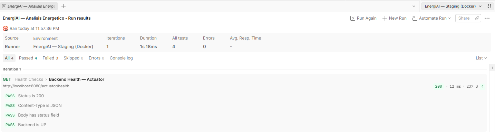 | Respuesta 200 del Actuator con `status: UP`. |
| 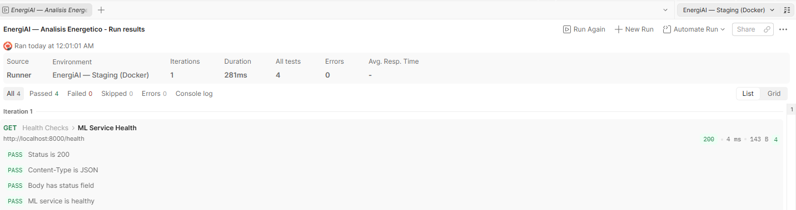 | Respuesta 200 del health check del ML con `status: healthy`. |
| 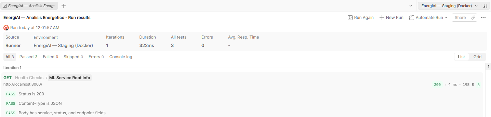 | Respuesta raíz del ML con campos `service`, `status` y `endpoint`. |

### 3.2. Happy Path — 3 Perfiles Energéticos

Validación de los 3 perfiles de usuario con respuestas JSON correctas (estructura completa: `id`, `fecha`, `categoria`, `probabilidad`, `costo_estimado_mensual`, `recomendaciones`).

| # | Nombre del Request | Método | Código HTTP Esperado | Descripción Breve |
|:-:|---|:-:|:-:|---|
| 4 | Perfil Eficiente | `POST` | `200` | Consumo bajo (200 kWh); valida estructura y categoría `Eficiente`. |
| 5 | Perfil Moderado | `POST` | `200` | Consumo medio (300 kWh); valida estructura y categoría `Moderado`. |
| 6 | Perfil Ineficiente | `POST` | `200` | Consumo alto (600 kWh); valida estructura y categoría `Ineficiente`. |

**Evidencias:**

| Evidencia | Descripción |
|---|---|
| 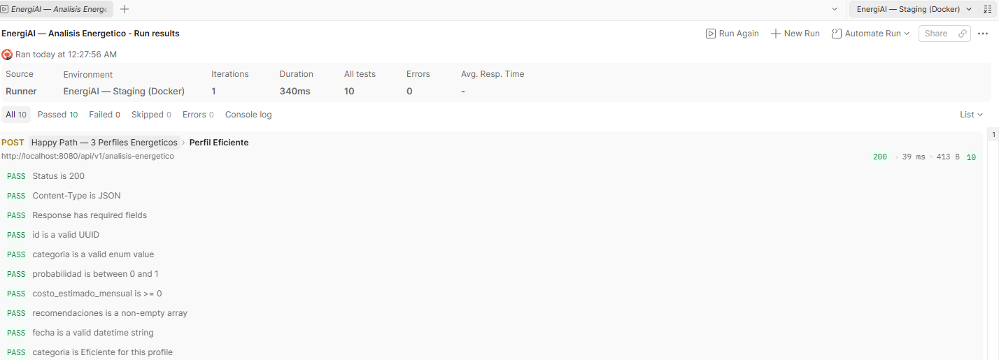 | Análisis con consumo bajo; respuesta 200 con categoría `Eficiente`. |
| 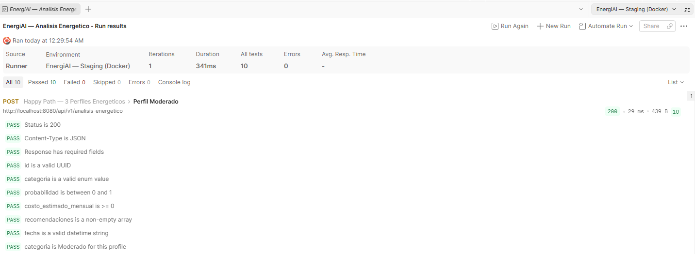 | Análisis con consumo medio; respuesta 200 con categoría `Moderado`. |
| 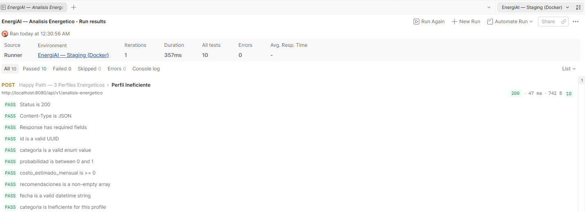 | Análisis con consumo alto; respuesta 200 con categoría `Ineficiente`. |

### 3.3. Validaciones HTTP 400

| # | Nombre del Request | Método | Código HTTP Esperado | Descripción Breve |
|:-:|---|:-:|:-:|---|
| 7 | Campo obligatorio nulo — consumo_kwh faltante | `POST` | `400` | JSON sin campos obligatorios; valida array `detalles` con `campo`/`mensaje`. |
| 8 | Valor fuera de rango — consumo_kwh > 1000 | `POST` | `400` | Envía `consumo_kwh: 1500`, fuera del rango permitido. |
| 9 | Enum inválido — tipo_inmueble inexistente | `POST` | `400` | Envía `tipo_inmueble: "CasaEstilo"`, valor fuera del enum. |
| 10 | JSON malformado — body no es JSON válido | `POST` | `400` | Body de texto plano no parseable; error `BAD_REQUEST`. |
| 11 | Body vacío — sin payload | `POST` | `400` | Request sin cuerpo. |

**Evidencias:**

| Evidencia | Descripción |
|---|---|
| 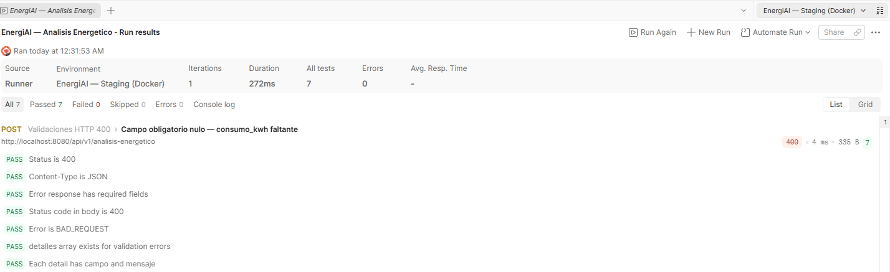 | Respuesta 400 con array `detalles` indicando el campo faltante. |
| 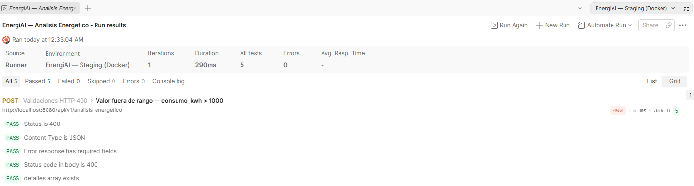 | Respuesta 400 por `consumo_kwh: 1500` fuera del rango permitido. |
| 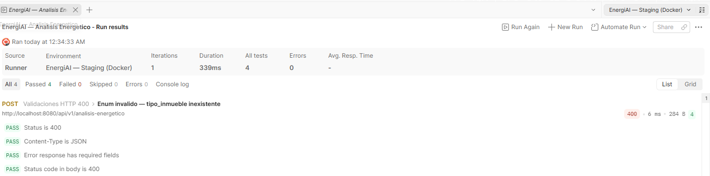 | Respuesta 400 por enum inválido en `tipo_inmueble`. |
| 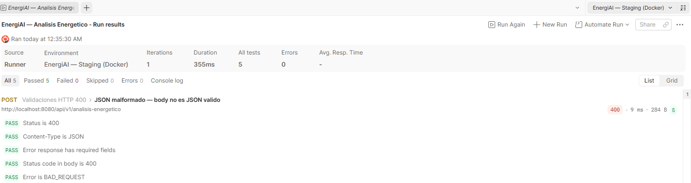 | Respuesta 400 `BAD_REQUEST` ante un body no parseable. |
| 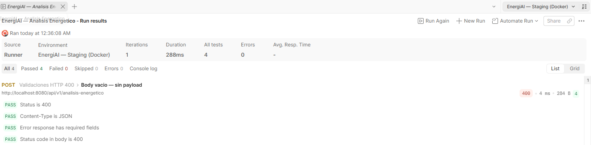 | Respuesta 400 ante un request sin cuerpo. |

### 3.4. Recurso No Encontrado HTTP 404

| # | Nombre del Request | Método | Código HTTP Esperado | Descripción Breve |
|:-:|---|:-:|:-:|---|
| 12 | GET análisis con UUID inexistente | `GET` | `404` | Consulta de análisis con UUID nulo; error `NOT_FOUND`. |

**Evidencias:**

| Evidencia | Descripción |
|---|---|
| 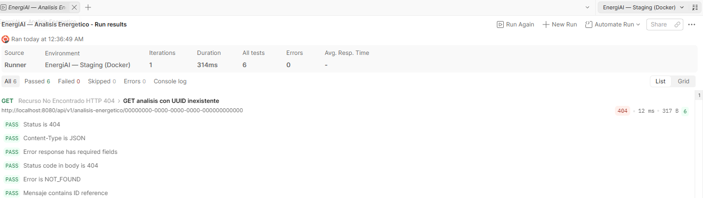 | Respuesta 404 `NOT_FOUND` al consultar un UUID inexistente. |

### 3.5. Respuesta Inválida de ML HTTP 502

> ⚠️ Requiere configuración especial del entorno (ver sección [4.6](#46-replicación-de-tests-especiales-errores-503-y-502)).

| # | Nombre del Request | Método | Código HTTP Esperado | Descripción Breve |
|:-:|---|:-:|:-:|---|
| 13 | ML retorna respuesta no-JSON — Backend responde 502 ⚠️ | `POST` | `502` | El ML devuelve HTML/texto no parseable; backend propaga error `BAD_GATEWAY` (requiere `mock_ml_server.py`). |

**Evidencias:**

| Evidencia | Descripción |
|---|---|
| 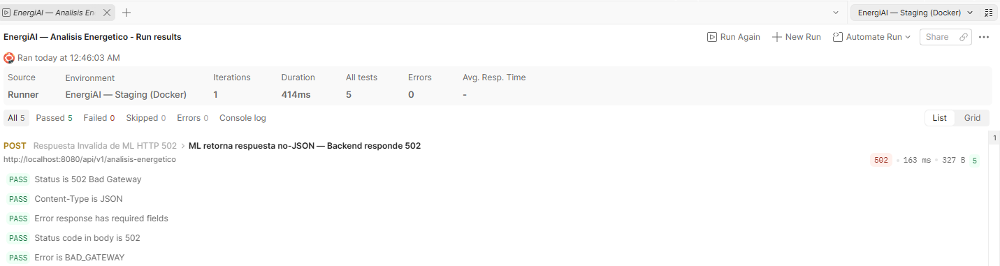 | Backend propaga `502 BAD_GATEWAY` cuando el mock retorna HTML. |

### 3.6. ML No Disponible HTTP 503

> ⚠️ Requiere detener el servicio ML (ver sección [4.6](#46-replicación-de-tests-especiales-errores-503-y-502)).

| # | Nombre del Request | Método | Código HTTP Esperado | Descripción Breve |
|:-:|---|:-:|:-:|---|
| 14 | ML apagado — Backend responde 503 ⚠️ | `POST` | `503` | Requiere `docker stop ml-service`; backend responde `SERVICE_UNAVAILABLE`. |

**Evidencias:**

| Evidencia | Descripción |
|---|---|
| 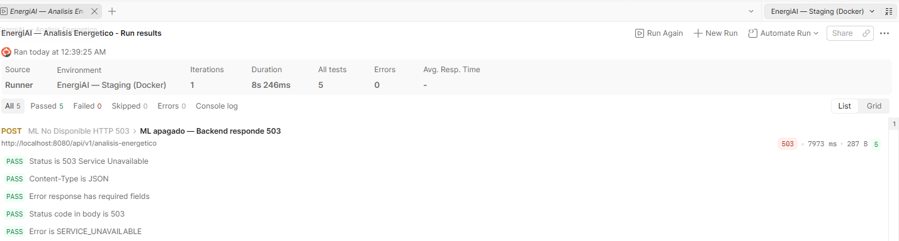 | Con `ml-service` detenido, el backend responde `503 SERVICE_UNAVAILABLE`. |

### 3.7. Timeout / Servicio ML Lento

> ⚠️ Requiere configurar timeouts cortos en el backend y latencia artificial en el ML (ver sección [4.6](#46-replicación-de-tests-especiales-errores-503-y-502)).

| # | Nombre del Request | Método | Código HTTP Esperado | Descripción Breve |
|:-:|---|:-:|:-:|---|
| 15 | ML timeout — Backend responde 503 ⚠️ | `POST` | `503` | El ML supera el *read-timeout* configurado; backend responde `SERVICE_UNAVAILABLE`. |

**Evidencias:**

| Evidencia | Descripción |
|---|---|
| 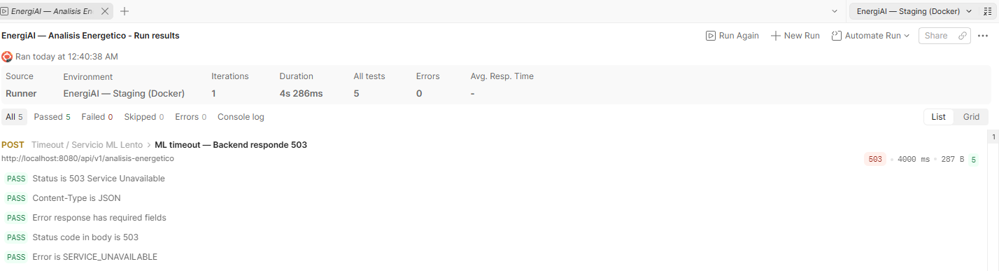 | Con latencia artificial en el ML, el backend responde `503 SERVICE_UNAVAILABLE` por timeout. |

### 3.8. Contract Validation — ML Service Directo

Requests directos contra el FastAPI del servicio ML (puerto 8000), sin pasar por el backend Spring Boot.

| # | Nombre del Request | Método | Código HTTP Esperado | Descripción Breve |
|:-:|---|:-:|:-:|---|
| 16 | Happy path — POST al ML directo | `POST` | `200` | Valida contrato del ML: `categoria`, `probabilidad`, `costo_estimado_mensual`, `recomendaciones` (sin `id` ni `fecha`). |
| 17 | Validación Pydantic 422 — campo obligatorio faltante | `POST` | `422` | Payload incompleto contra el ML; valida array `detail` de Pydantic (`loc`, `msg`, `type`). |
| 18 | ML Health detallado | `GET` | `200` | Health check directo del ML (`status: healthy`). |

**Evidencias:**

| Evidencia | Descripción |
|---|---|
| 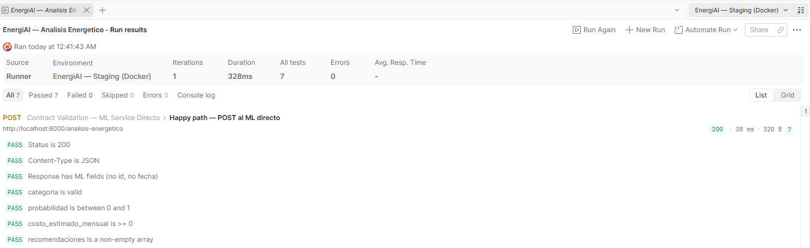 | Respuesta 200 directa del FastAPI, sin `id` ni `fecha`. |
| 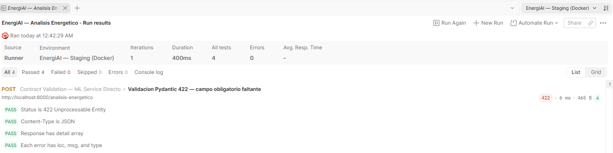 | Respuesta 422 con array `detail` de Pydantic. |
| 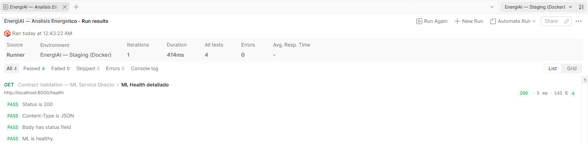 | Health check directo del ML con `status: healthy`. |

> **Nota sobre los tests marcados con ⚠️:** requieren una configuración especial del entorno Docker, explicada en la sección ["Replicación de Tests Especiales"](#46-replicación-de-tests-especiales-errores-503-y-502). En particular, el test 502 requiere que el servicio real de ML esté detenido (`docker stop ml-service`) y que se ejecute el script de Flask `mock_ml_server.py`, que retorna HTML explícitamente para simular la falla de parseo de JSON en el backend.

---

## 4. Cómo Replicar las Pruebas

Siga los pasos a continuación para levantar el entorno y ejecutar las pruebas localmente.

### 4.1. Prerequisitos

Asegúrese de tener instaladas las siguientes herramientas en su máquina:

| Herramienta | Propósito | Instalación / Notas |
|---|---|---|
| **Docker y Docker Compose** | Orquestar los contenedores (Backend, ML Service, Nginx, etc.). | [Docker Desktop](https://www.docker.com/products/docker-desktop/) |
| **Python 3.x** | Ejecutar el servidor mock si se requiere. | [python.org](https://www.python.org/downloads/) |
| **Flask** | Framework web de Python para el mock. | `pip install flask` |
| **IDE** (VS Code, IntelliJ, etc.) | Editar y ejecutar comandos. | — |
| **Postman** | Importar la colección y ejecutar los tests. | [postman.com](https://www.postman.com/downloads/) |

### 4.2. Clonación del Repositorio

Puede acceder al repositorio de dos formas:

**Opción A: Desde el navegador**

1. Abra su navegador web.
2. Navegue a: <https://github.com/No-Country-simulation/G9-LATAM-TEAM-09>
3. Descargue el código fuente en formato ZIP o clone el repositorio.

**Opción B: Desde la terminal**

Ejecute el siguiente comando en la carpeta deseada:

```bash
git clone https://github.com/No-Country-simulation/G9-LATAM-TEAM-09.git
cd G9-LATAM-TEAM-09
```

### 4.3. Levantamiento del Entorno (Modo Estándar)

1. Abra la terminal en la raíz del proyecto.
2. Ejecute el siguiente comando para iniciar los servicios en segundo plano:

   ```bash
   docker compose up -d
   ```

3. Espere a que Docker descargue las imágenes y levante los contenedores.
4. Verifique que todos los servicios estén "Up" en la aplicación de Docker Desktop o en la terminal.

   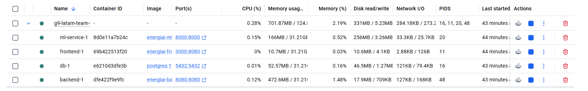

### 4.4. Configuración y Ejecución en Postman

1. Abra Postman.
2. Importe la colección: vaya a **File > Import** y arrastre el archivo `EnergiAI.postman_collection.json`.
3. Importe el entorno: vaya a **File > Import** y arrastre el archivo `EnergiAI.postman_staging_environment.json`.
4. Active el entorno importado desde el selector de entornos en la esquina superior derecha.
5. Abra la colección **EnergiAI — Analisis Energetico**. Notará que contiene **18 requests** organizados en **8 carpetas** por funcionalidad.

### 4.5. Ejecución de Tests Estándar (Happy Path & Validaciones)

Para los tests normales (health checks, perfiles, errores 400/404):

1. En la colección, seleccione todos los tests o los específicos que desee validar.
2. **Recomendación:** desactive temporalmente los tests relacionados con fallos críticos (502, 503) si no tiene la infraestructura de mock lista, para evitar errores confusos.

   Tests a desactivar inicialmente:
   - ML apagado — Backend responde 503
   - ML timeout — Backend responde 503
   - ML retorna respuesta no-JSON — Backend responde 502

3. Ejecute el *run* de los tests seleccionados.
4. Revise la consola de resultados: observe los tiempos de respuesta, el código HTTP esperado vs. real, y los logs de las aserciones.

### 4.6. Replicación de Tests Especiales (Errores 503 y 502)

Algunos tests validan el comportamiento del sistema ante fallos del servicio de Machine Learning. Estos requieren una configuración distinta.

#### A. Tests de Error 503 (ML Fuera de Servicio / Timeout)

Para validar que el backend retorna `503` cuando el ML falla:

1. **Detener el servicio ML:**
   - Abra Docker Desktop y detenga manualmente el contenedor `ml-service`.
   - O desde terminal:

     ```bash
     docker stop ml-service
     ```
     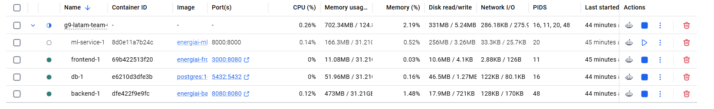

2. **Ejecutar el test:**
   - En Postman, seleccione únicamente el request **ML apagado — Backend responde 503** o **ML timeout — Backend responde 503**.
   - Ejecute el test.

3. **Verificación:**
   - El backend debe devolver `503 Service Unavailable`.

   > **Nota:** para el test de timeout, asegúrese de que el cliente espere el tiempo configurado (ej. 5 segundos) antes de recibir la respuesta de error.

4. **Recuperar el servicio:**

   ```bash
   docker start ml-service
   # o bien
   docker compose up -d
   ```

#### B. Test de Error 502 (Mock ML Server)

Para validar que el backend maneja correctamente respuestas no-JSON o HTML inesperadas del ML:

1. **Detener el servicio ML real:**
   - Asegúrese de que `ml-service` no esté corriendo.
   - Detenga el stack de Docker actual:

     ```bash
     docker compose down
     ```

2. **Levantar el entorno con Mock:**
   - Ejecute el siguiente comando para levantar el servicio mock en lugar del ML real:

     ```bash
     docker compose -f docker-compose.yml -f docs/backend/postman/docker-compose.test.yml up --build
     ```

   > **Nota:** este comando activa el servicio `mock_ml_server` que simula respuestas HTML en lugar de JSON.

3. **Verificar el Mock:**
   - Asegúrese de que el servicio `mock_ml_server` esté corriendo en `http://localhost:8000`.
   - Si lo ejecuta manualmente en Python:

     ```bash
     python mock_ml_server.py
     ```

   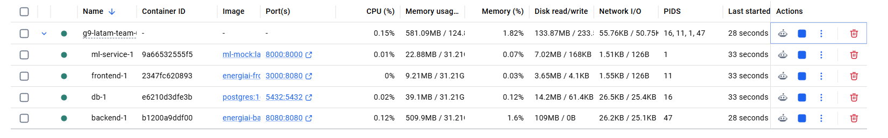

4. **Ejecutar el test 502:**
   - En Postman, seleccione el test: **ML retorna respuesta no-JSON — Backend responde 502**.
   - Ejecute el test.

5. **Resultado esperado:**
   - El backend recibirá un HTML (`<h1>502 Bad Gateway</h1>`) del mock.
   - Al intentar parsear esto como JSON, fallará y el backend propagará el error, retornando finalmente un `502 Bad Gateway` al cliente (Postman).
   - El test debe pasar correctamente validando este código de estado.

### 4.7. Apagado del Entorno

Para detener los servicios y liberar recursos:

- **Desde Docker Desktop:** seleccione todos los contenedores y haga clic en "Stop".
- **Desde la terminal:**

  ```bash
  docker compose down
  ```

> **Nota:** si usó el archivo de test específico, asegúrese de detener los contenedores correspondientes o ejecute:
>
> ```bash
> docker compose -f docker-compose.yml -f docs/backend/postman/docker-compose.test.yml down
> ```
