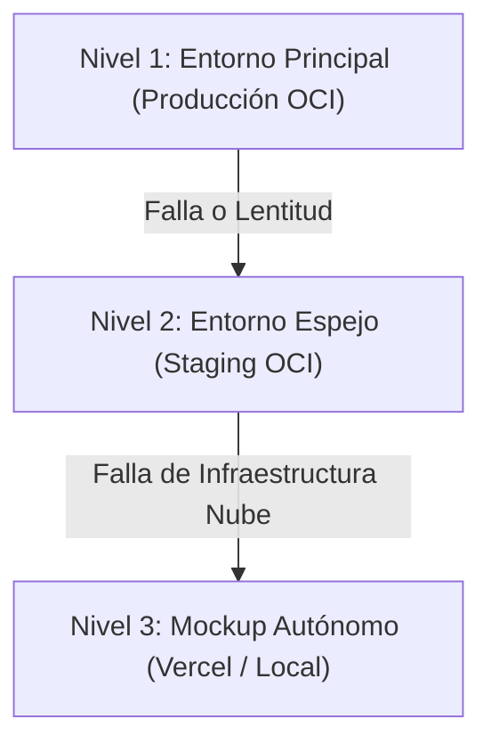

# 🎯 Guía de Respaldo Técnico y Contingencia Operativa para la Demo

**Propósito:** Proporcionar al equipo un guion técnico de demostración, un banco de datos de prueba pre-validados y un protocolo de contingencia estructurado en 3 niveles ante cualquier eventualidad durante la presentación en vivo.

---

## 🌐 1. URLs Oficiales para la Demostración

| Recurso | URL | Descripción |
|---|---|---|
| **Aplicación Web (Producción)** | `https://energiai.unixsoluciones.com/` | Interfaz interactiva de usuario principal. |
| **Aplicación Web (Staging)** | `https://energiai-staging.unixsoluciones.com/` | Entorno de respaldo funcional idéntico. |
| **Swagger UI (Staging)** | `https://energiai-staging.unixsoluciones.com/swagger-ui/index.html` | Ejecución en vivo de la API REST para jurado técnico. |
| **OpenAPI Spec (JSON)** | `https://energiai-staging.unixsoluciones.com/v3/api-docs` | Especificación para importar en Postman / Insomnia. |
| **Mockup de Respaldo (Vercel)** | `https://energiai-mockup-p01-p02.vercel.app/` | Frontend estático con respuestas simuladas de contingencia. |

---

## 🧪 2. Banco de Payloads de Prueba (Casos Canónicos)

Utilizar estos payloads para demostrar la capacidad del modelo ML para clasificar los tres perfiles energéticos:

### Caso A: Perfil Eficiente (Bajo consumo, aislamiento alto, solar)
```json
{
  "consumo_kwh": 180.0,
  "cantidad_equipos": 5,
  "tipo_inmueble": "Casa",
  "horas_alto_consumo": 3,
  "uso_horario_pico": false,
  "metros_cuadrados": 70,
  "antiguedad_vivienda": 3,
  "zona_fria": false,
  "calidad_aislamiento": "Alta",
  "fuente_calefaccion": "Solar",
  "fuente_agua_caliente": "Solar"
}
```
- **Resultado Esperado:** Categoría `Eficiente`, costo mensual estimado ~$135.00, recomendaciones orientadas a mantenimiento de hábitos.

---

### Caso B: Perfil Moderado (Consumo medio, aislamiento estándar)
```json
{
  "consumo_kwh": 380.0,
  "cantidad_equipos": 8,
  "tipo_inmueble": "Departamento",
  "horas_alto_consumo": 5,
  "uso_horario_pico": true,
  "metros_cuadrados": 60,
  "antiguedad_vivienda": 8,
  "zona_fria": false,
  "calidad_aislamiento": "Media",
  "fuente_calefaccion": "Electricidad",
  "fuente_agua_caliente": "Electricidad"
}
```
- **Resultado Esperado:** Categoría `Moderado`, costo mensual estimado ~$285.00, recomendaciones de optimización de climatización y equipos standby.

---

### Caso C: Perfil Ineficiente (Alto consumo, sin aislamiento, uso intensivo en punta)
```json
{
  "consumo_kwh": 750.0,
  "cantidad_equipos": 14,
  "tipo_inmueble": "Comercio",
  "horas_alto_consumo": 10,
  "uso_horario_pico": true,
  "metros_cuadrados": 120,
  "antiguedad_vivienda": 25,
  "zona_fria": true,
  "calidad_aislamiento": "Baja",
  "fuente_calefaccion": "Electricidad",
  "fuente_agua_caliente": "Electricidad"
}
```
- **Resultado Esperado:** Categoría `Ineficiente`, costo mensual estimado ~$562.50, recomendaciones prioritarias de recambio tecnológico y reducción en horario punta.

---

## 🛡️ 3. Plan de Contingencia de 3 Niveles

Si ocurre un imprevisto durante la demo (caída de red local, latencia, reinicio de servicios), seguir este protocolo escalonado:



### Nivel 1 — Producción OCI (`energiai.unixsoluciones.com`)
- Demostración principal en vivo interactuando desde el formulario web.

### Nivel 2 — Staging OCI (`energiai-staging.unixsoluciones.com`)
- Si Producción presenta problemas, cambiar de inmediato a la pestaña de Staging. Es una copia 100% aislada e independiente en la misma VM.

### Nivel 3 — Mockup Desacoplado en Vercel (`energiai-mockup-p01-p02.vercel.app`)
- Si la VM de OCI sufre cortes de conectividad externa, la presentación continúa fluidamente en Vercel mostrando el flujo de usuario y los 8 estados de pantalla.

---

## ⚡ 4. Comandos de Recuperación Rápida (Cheat Sheet de Emergencia)

Si el operador tiene acceso SSH a la VM durante la demo:

```bash
# 1. Comprobar salud de los contenedores
docker compose -p energiai-prod ps
docker compose -p energiai-staging ps

# 2. Reiniciar el backend en caliente (5 segundos)
docker compose -p energiai-prod restart backend

# 3. Reiniciar el proxy Caddy
sudo systemctl restart caddy

# 4. Ver logs de inferencia en tiempo real
docker compose -p energiai-prod logs -f --tail=20 ml-service
```
