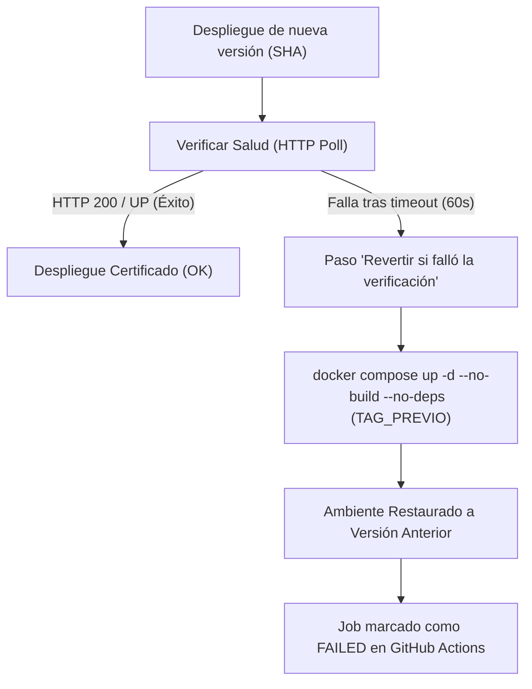

# 🧯 Runbook Operativo de Rollback — EnergiAI

**Propósito:** Definir el procedimiento formal y reproducible para revertir despliegues en Staging y Producción ante anomalías, fallas en healthchecks o errores críticos de integración.

---

## 🧭 1. Principio de Inmutabilidad y Rollback Sin Reconstrucción

En EnergiAI, cada despliegue de CD (`cd-backend.yml`, `cd-ml.yml`, `cd-frontend.yml`):
- Construye y etiqueta las imágenes de Docker con el **SHA del commit** (`energiai-<servicio>:<SHA>`).
- Registra el tag previo antes de desplegar.
- Mantiene las últimas **5 imágenes en la VM** y **nunca elimina imágenes asociadas a contenedores existentes** (`docker ps -a`).

> ✅ **Ventaja Operativa:** Revertir un despliegue **no recompila código**. Relevanta de manera inmediata exactamente el mismo binario e imagen que ya funcionaba en la VM, completando el rollback en < 10 segundos.

---

## 🤖 2. Método 1: Rollback Automático en CD (Falla de Healthcheck)

Cada flujo de CD incluye un paso de verificación de salud posterior al levantamiento del contenedor:



### Comportamiento del Sistema:
1. Si `/actuator/health` (Backend), `/health` (ML) o `/` (Frontend) no responden satisfactoriamente:
   - Se capturan los últimos 50 logs del contenedor y el estado de `docker compose ps`.
   - Se ejecuta `docker compose -p <proyecto> up -d --no-build --no-deps <servicio>` apuntando a `steps.previa.outputs.tag`.
   - El job falla en GitHub Actions para alertar al equipo, pero el servicio en la VM queda restaurado y operativo.

---

## 🖱️ 3. Método 2: Rollback Manual vía GitHub Actions (Recomendado)

Si se detecta un error funcional o lógico post-despliegue que no afectó el healthcheck básico:

### Pasos:
1. Ir a la pestaña **Actions** del repositorio: [GitHub Actions](https://github.com/No-Country-simulation/G9-LATAM-TEAM-09/actions).
2. Seleccionar el workflow del componente a revertir:
   - `CD Backend (Spring Boot)`
   - `CD Data Science / ML (FastAPI)`
   - `CD · Front-End`
3. Hacer clic en el botón **Run workflow**.
4. Completar los parámetros:
   - **Ambiente de destino:** `staging` o `produccion`.
   - **SHA a desplegar (tag):** Pegar el SHA del commit de la versión estable anterior (se puede obtener del resumen del deploy previo en `$GITHUB_STEP_SUMMARY` o de `git log`).
5. Hacer clic en **Run workflow**.
6. El runner self-hosted detectará la imagen existente en la VM (`La imagen energiai-<servicio>:<SHA> ya existe — se reutiliza (rollback)`) y la pondrá en ejecución inmediatamente.

---

## 💻 4. Método 3: Rollback de Emergencia vía SSH (Acceso Directo a la VM)

En caso de indisponibilidad de GitHub Actions o pérdida de conectividad con el runner:

### 1. Conectarse a la instancia OCI:
```bash
ssh -i ~/.ssh/energiai-app-01 ubuntu@159.112.131.149
```

### 2. Identificar la versión/imagen previa disponible:
```bash
# Listar imágenes disponibles del servicio
docker images "energiai-backend"
docker images "energiai-ml-service"
docker images "energiai-frontend"
```

### 3. Ejecutar el rollback manual en el proyecto Compose correspondiente:

**Para Staging (`energiai-staging`):**
```bash
# Ejemplo: Revertir Backend en Staging al SHA 72f68a0
export BACKEND_TAG="72f68a0"
export BACKEND_PORT="8081"
docker compose --env-file ~/energiai-envs/.env.staging -p energiai-staging up -d --no-build --no-deps backend

# Ejemplo: Revertir ML Service en Staging al SHA 72f68a0
export ML_TAG="72f68a0"
export ML_PORT="8002"
docker compose --env-file ~/energiai-envs/.env.staging -p energiai-staging up -d --no-build --no-deps ml-service

# Ejemplo: Revertir Frontend en Staging al SHA 72f68a0
export FRONTEND_TAG="72f68a0"
export FRONTEND_PORT="3001"
docker compose --env-file ~/energiai-envs/.env.staging -p energiai-staging up -d --no-build --no-deps frontend
```

**Para Producción (`energiai-prod`):**
```bash
# Mismo procedimiento usando ~/.env.prod, proyecto energiai-prod y puertos (8080/8000/3000)
export BACKEND_TAG="<SHA_ANTERIOR>"
export BACKEND_PORT="8080"
docker compose --env-file ~/energiai-envs/.env.prod -p energiai-prod up -d --no-build --no-deps backend
```

---

## ✅ 5. Verificación Post-Rollback

Tras cualquier procedimiento de rollback, ejecutar la lista de chequeo de verificación:

1. **Estado de Contenedores:**
   ```bash
   docker compose -p energiai-staging ps
   ```
2. **Healthchecks HTTP:**
   - Frontend: `curl -I https://energiai-staging.unixsoluciones.com/` (HTTP 200)
   - Backend Actuator: `curl https://energiai-staging.unixsoluciones.com/actuator/health` (`"status":"UP"`)
   - Backend Readiness: `curl https://energiai-staging.unixsoluciones.com/actuator/health/readiness` (`"status":"UP"`)
3. **Prueba Funcional:**
   - Realizar una solicitud de prueba en Swagger UI o mediante `POST /api/v1/analisis-energetico`.
