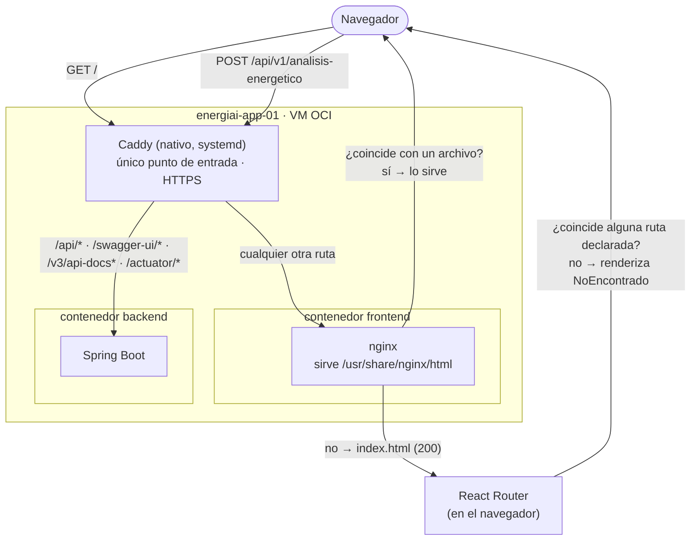
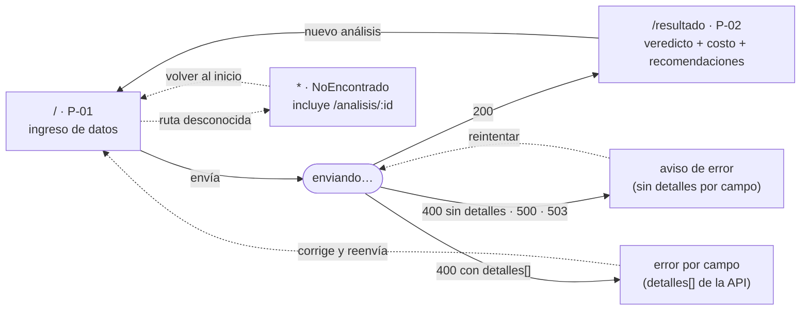

# 🖥️ Front-End — Arquitectura y decisiones

## 📌 Resumen

El front-end es una aplicación **Vite + React 19 + TypeScript** que compila a
estáticos. Se sirve con **nginx** dentro de un contenedor propio, detrás del
mismo proxy Caddy que ya expone el back-end — mismo origen, sin CORS. El
código vive en [`frontend/`](../../frontend/README.md); esta página documenta
**por qué** está armado así, no el día a día de trabajar en él (para eso, el
README del propio directorio).

---

## 🗺️ Flujo de una petición



Caddy decide **por dominio y por path** a qué contenedor va cada request —no
sabe nada de React ni de rutas del cliente—. nginx decide **si el path pedido
es un archivo real**: si no lo es, devuelve siempre `index.html` con 200 (el
patrón estándar de una SPA). Recién ahí, ya en el navegador, **React Router**
decide qué pantalla mostrar — incluida la de «no encontrado» cuando ninguna
ruta declarada coincide.

Ninguna de las tres capas sabe resolver sola lo que las otras dos resuelven:
Caddy no entiende de rutas de cliente, nginx no entiende de dominios ni de
Swagger, y React no ve una request hasta que ya le sirvieron el HTML.

---

## 🤔 ¿Por qué nginx, si Caddy ya es el proxy?

Pregunta legítima: Caddy sabe servir estáticos y hacer *fallback* de SPA por
sí solo (`file_server` + `try_files`). No es indispensable por capacidad
técnica — es una decisión con costos y beneficios concretos, no la única
opción correcta.

**A favor del diseño actual (contenedor propio + nginx):**

- **La VM no acumula carpetas de la app, a propósito.** Así lo documenta
  [`docs/oci-cloud/README.md`](../oci-cloud/README.md#-despliegue): *"la app
  no tiene carpeta propia en la VM… la VM no acumula copias de código que
  puedan divergir"*. Si Caddy sirviera los archivos directo desde disco,
  alguien tendría que extraer el `dist/` de la imagen al filesystem del
  host — justo lo que ese diseño evita.
- **El rollback no se reinventa.** Hoy, para los tres componentes, volver
  atrás es *"relevantá el contenedor con este otro tag de imagen"* — el CD
  lo hace sin reconstruir. Si Caddy leyera de una carpeta, rollback pasaría
  a ser *"reemplazá el contenido de una carpeta atómicamente"*, con su
  propia lógica aparte de la de Docker.
- **Los tres componentes quedan simétricos.** Front, back y ML son la misma
  forma: imagen + puerto interno + healthcheck + workflow de CD. Caddy no
  necesita saber cómo está armado ninguno de los tres.
- **El contenedor se puede probar aislado**, sin Caddy ni los otros
  servicios — así se verificó cada cambio de esta migración.

**En contra (costo real, no descartable):**

- Un salto de red más por request: navegador → Caddy → nginx → archivo.
  En esta VM (2 OCPUs, tráfico de hackathon) el costo es mínimo, pero es
  una pieza más que puede fallar — el healthcheck lo hizo (ver más abajo).
- Una imagen más para construir, un `nginx.conf` más que mantener
  sincronizado con el `Caddyfile`.

**Conclusión:** para el tamaño actual del proyecto, la simplicidad del
rollback pesa más que el salto extra de red. Si el equipo prefiere menos
piezas móviles, servir estáticos directo desde Caddy es una alternativa
legítima — implicaría resolver el rollback del front de otra forma.

---

## 🩹 Bug encontrado y corregido: healthcheck contra `localhost`

Los contenedores del front quedaban marcados **`unhealthy`** en staging y en
producción, aunque el sitio respondiera 200 en el dominio público. Causa,
confirmada dentro del contenedor desplegado:

```bash
wget --spider http://localhost:8080/   # exit 1 · Connection refused
wget --spider http://127.0.0.1:8080/   # exit 0
```

Dentro del contenedor, `localhost` resuelve primero a `::1` (IPv6), y nginx
solo escucha en IPv4 (`0.0.0.0:8080`). El `HEALTHCHECK` del `Dockerfile` usa
`127.0.0.1` explícito para evitar la ambigüedad. No afectaba al servicio en
sí —el CD verifica con `curl` desde la VM, no con el healthcheck de Docker—,
pero dejaba a los dos ambientes reportando un estado falso, y habría
bloqueado cualquier `depends_on: condition: service_healthy` a futuro.

---

## 🧭 Flujo de la aplicación (rutas y estados)



`/analisis/:id` existe a propósito aunque hoy siempre caiga en «no
encontrado»: la API no devuelve identificador ni hay persistencia (PA-19),
así que ningún análisis se puede recuperar por enlace. La ruta documenta ese
hueco del contrato en vez de esconderlo.

---

## 📋 Otras decisiones registradas

- **Mensajes de error propios, no los crudos de la API.** Frases como *"no
  debe ser nulo"* o *"El servicio de Machine Learning rechazó los datos de
  entrada (HTTP 422)"* están escritas para quien desarrolla, no para quien
  usa la app. Los errores por campo muestran texto propio y caen al mensaje
  de la API si el campo no está contemplado, para no ocultar una validación
  imprevista. El mensaje crudo queda disponible en un detalle técnico
  plegable — útil para reportarle al equipo de back qué respondió el
  servidor sin abrir las herramientas del navegador.
- **Imagen base de nginx fijada por digest**, no por etiqueta: `1.27-alpine`
  es una etiqueta móvil, y reconstruir un commit viejo con una base distinta
  volvería poco confiable el rollback.
- **El front no maneja secretos.** No lee ninguna variable en runtime; el
  modo (mock o API real) se resuelve al compilar. Es, de los tres
  componentes, el que menos depende de que `~/energiai-envs/` exista.
- El prototipo original en HTML/CSS/JS puro (anterior a esta migración)
  queda archivado en [`frontend/prototipo-estatico/`](../../frontend/prototipo-estatico/README.md),
  excluido del build.

Detalle completo del código, cómo correr en local y conectar contra la API
real: [`frontend/README.md`](../../frontend/README.md).

---

## 📅 Informes por sprint

Participación, decisiones y evidencias de cada período. Cada informe es
autocontenido y lleva sus documentos como anexos.

| Sprint | Informe | Contenido principal |
|---|---|---|
| Semana 1 | [`semanas/semana-1/`](./semanas/semana-1/informe.md) | Etapas del diseño, wireframe v1 |
| Semana 2 | [`semanas/semana-2/`](./semanas/semana-2/informe.md) | Wireframe v2 acotado a P-01/P-02, contrato V1.1, infraestructura de OCI |
| Semana 3 | [`semanas/semana-3/`](./semanas/semana-3/informe.md) | Contrato V1.2, front desplegado, despliegue continuo, migración a Vite |
