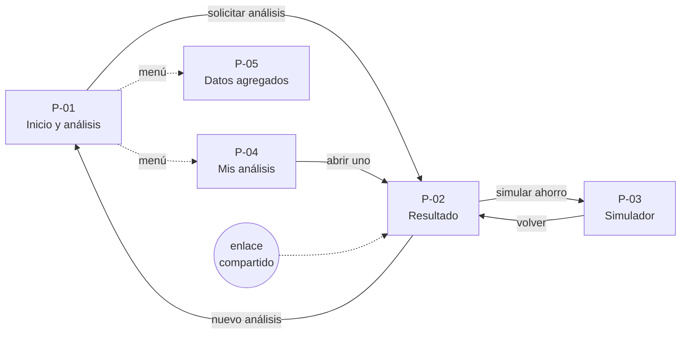
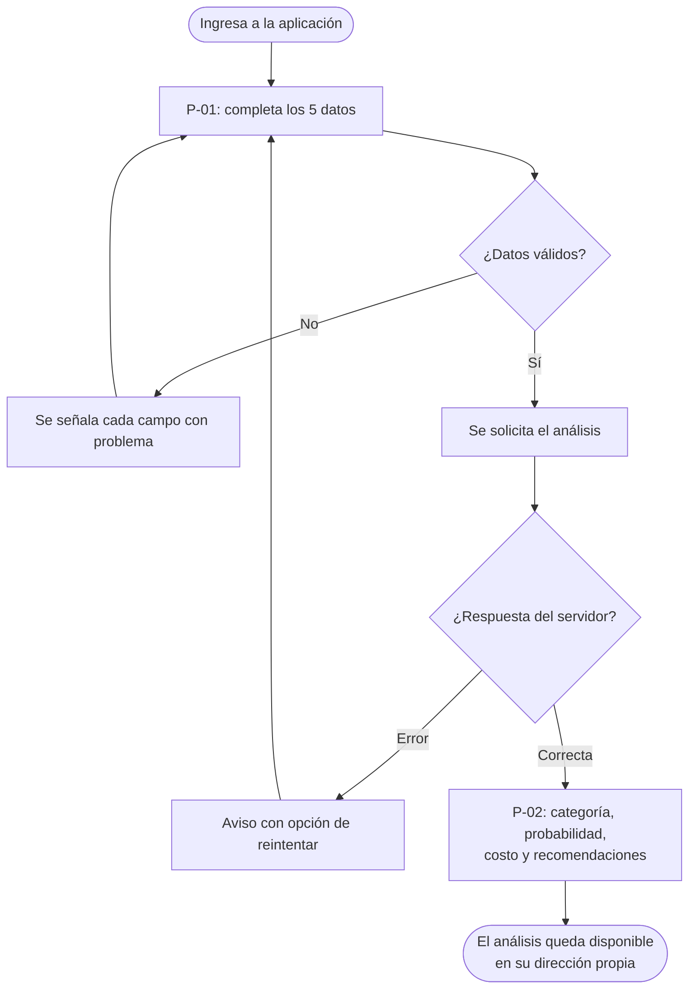
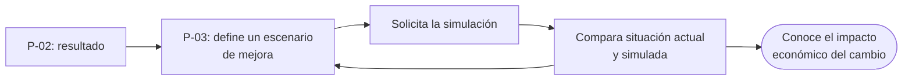
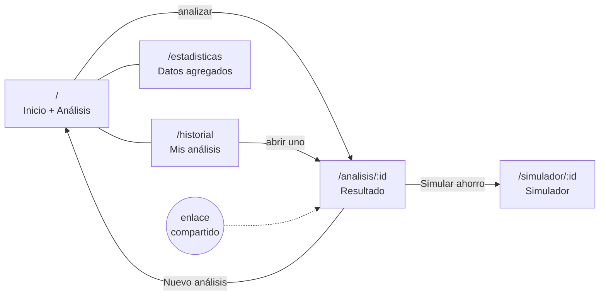
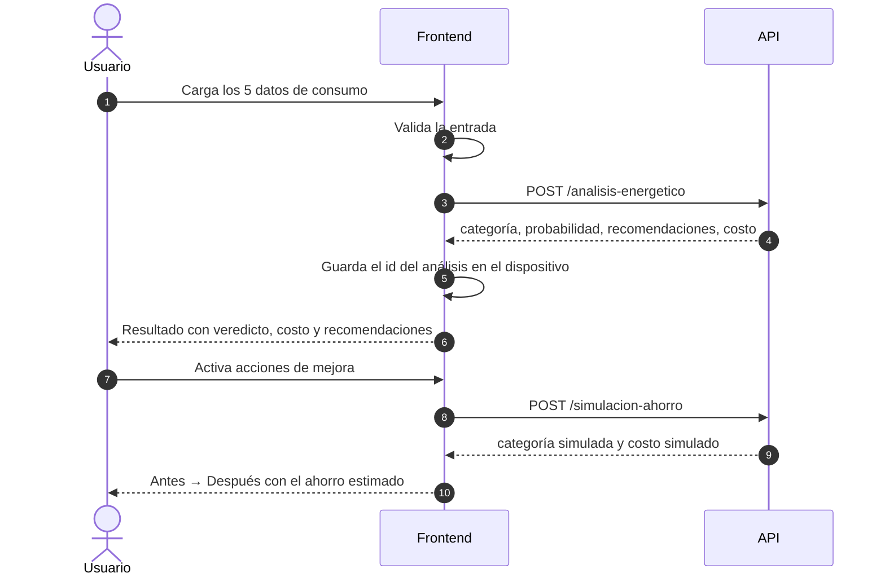

# Etapas del diseño frontend (1–5) — snapshot Semana 1

> 📸 **Snapshot de la Semana 1 (estado al 22–26 de julio de 2026).** Anexo del [Informe Semana 1](../informe.md). Este documento centraliza las etapas del diseño frontend (1, 2, 3 y 5; la etapa 4 no tiene documento propio — es el [prototipo desplegado](https://energiaimockup.vercel.app/)) **tal como estaban en ese momento**, sin retro-editar: refleja los supuestos previos a la re-auditoría del PM del 28/07 — catálogo con «Oficina», moneda «R$», equipos 1–500 y endpoints todavía propuestos, no implementados. Las correcciones posteriores viven en la [Adenda Sprint 2](../../semana-2/anexos/adenda-sprint-2.md). Se preserva así como evidencia del estado del proyecto en ese momento.

---

# 1️⃣ Etapa 1 — Especificación de requerimientos

**Etapa 1 de 5.** Define qué debe hacer la interfaz, antes de decidir cómo se ve o cómo se organiza. Es la base de trazabilidad: todo elemento que aparezca en los wireframes (etapa 3) debe poder atarse a un requisito de este documento.

**Versión:** 1.0 — para revisión del equipo · **Fecha:** 22 de julio de 2026 · **Fuente:** Enunciado del Proyecto 3 (EnergiAI) y contrato de API acordado · **Estado:** Pendiente de aprobación

Leyenda: 📌 obligatorio según el enunciado · ⭐ recurso opcional del enunciado · 💡 decisión del equipo

## 1. Propósito y alcance

**Propósito.** Enumerar de forma verificable lo que la interfaz de usuario debe permitir hacer, para poder validar después que el diseño y la implementación lo cumplen.

**Alcance.** Cubre únicamente el frontend: la aplicación web que consume la API REST del proyecto. No cubre el modelo de Machine Learning, la API ni la infraestructura, documentados aparte.

**Contexto de producto.** El enunciado plantea que muchas personas reciben facturas de energía elevadas pero tienen poca visibilidad sobre qué hábitos impactan en su gasto. El frontend es la vitrina de la solución: convierte los datos de consumo en información clara y accionable.

**Correspondencia con el enunciado.** El enunciado define el front-end como opcional para el MVP, pero establece con precisión qué debe contener si se desarrolla. Este documento cubre las cuatro funciones enumeradas:

| Función indicada en el enunciado | Requisitos que la cubren |
|---|---|
| Ingreso de información de consumo | RF-01, RF-02, RF-03 |
| Visualización de resultados | RF-04, RF-05, RF-06, RF-11 |
| Presentación de recomendaciones | RF-07 |
| Muestra de gráficos e indicadores | RF-15, RF-18 |

Por lo tanto, los gráficos e indicadores no son un agregado del equipo: forman parte de la definición de front-end del enunciado.

## 2. Actores

| Actor | Descripción | Conocimiento técnico |
|---|---|---|
| **Usuario residencial** | Persona que quiere entender y reducir su factura de luz. Actor principal | Ninguno |
| **Responsable de un local u oficina** | Analiza el consumo de un inmueble no residencial | Bajo |
| **Evaluador / jurado** | Recorre la aplicación para verificar el cumplimiento del enunciado | Alto |

Ninguno se autentica: la aplicación es de acceso público y anónimo (ver §6, decisión D-01).

## 3. Historias de usuario

Cada historia incluye sus criterios de aceptación, redactados para poder verificarse observando la interfaz.

### Núcleo (obligatorio)

**HU-01 — Ingresar mis datos de consumo** 📌
*Como* persona con una factura de luz elevada, *quiero* cargar los datos de mi consumo, *para* obtener un análisis de mi eficiencia energética.

- La interfaz solicita exactamente los cinco datos del contrato: consumo mensual en kWh, tipo de inmueble, cantidad de equipos, uso en horario pico y horas de alto consumo.
- Cada campo indica en lenguaje sencillo qué debe ingresarse.
- El análisis se solicita con una única acción.

**HU-02 — Conocer mi clasificación energética** 📌
*Como* usuario, *quiero* ver en qué categoría de eficiencia me ubico, *para* entender mi situación.

- Se muestra una de las tres categorías: Eficiente, Moderado o Ineficiente.
- La categoría es el elemento más prominente del resultado.
- Se distingue sin depender del color únicamente.

**HU-03 — Saber cuán confiable es el resultado** 📌
*Como* usuario, *quiero* conocer la probabilidad asociada a la clasificación, *para* dimensionar su certeza.

- Se muestra el valor de probabilidad devuelto por la API, expresado en porcentaje.
- Se acompaña de una etiqueta comprensible para quien no conoce el término técnico.

**HU-04 — Conocer el costo de mi consumo** 📌
*Como* usuario, *quiero* ver cuánto dinero representa mi consumo, *para* dimensionar el problema.

- Se muestra el costo mensual estimado devuelto por la API.
- Se indica la tarifa de referencia utilizada.

**HU-05 — Recibir recomendaciones concretas** 📌
*Como* usuario, *quiero* recibir sugerencias de mejora, *para* saber qué hacer con el resultado.

- Se listan todas las recomendaciones devueltas por la API.
- Están redactadas como acciones concretas.

**HU-06 — Volver a consultar un análisis** 📌
*Como* usuario, *quiero* recuperar un análisis ya realizado, *para* revisarlo o compartirlo.

- Cada análisis tiene una dirección propia que puede abrirse directamente.
- Abrir esa dirección muestra el análisis completo, tal como se vio la primera vez.
- La interfaz ofrece copiar esa dirección.

**HU-07 — Entender los errores** 📌
*Como* usuario, *quiero* saber qué pasó cuando algo falla, *para* poder corregirlo o reintentar.

- Los datos inválidos se señalan campo por campo, sin perder lo ya cargado.
- Los fallos del servidor se comunican en lenguaje claro y ofrecen reintentar.
- El bloqueo por exceso de consultas se distingue de un error del servidor.

### Recursos opcionales del enunciado

**HU-08 — Simular escenarios de ahorro** ⭐
*Como* usuario, *quiero* ver cuánto ahorraría si cambiara mis hábitos, *para* decidir si vale la pena.

- Puedo modificar mi escenario y obtener una nueva clasificación y un nuevo costo.
- Se muestra la comparación entre la situación actual y la simulada.
- Se expresa el resultado económico de la diferencia.

**HU-09 — Ver mis análisis anteriores** ⭐
*Como* usuario, *quiero* acceder a los análisis que hice antes, *para* no perderlos.

- Se listan los análisis previos con fecha, categoría y costo.
- Cada uno se puede abrir.
- La interfaz explica el alcance de esa lista.

**HU-10 — Seguir mi evolución en el tiempo** ⭐
*Como* usuario recurrente, *quiero* ver cómo evoluciona mi consumo, *para* saber si estoy mejorando.

- Se representa gráficamente la serie de análisis ordenada cronológicamente.
- Se indica la variación entre el primero y el más reciente.

**HU-11 — Comparar dos períodos** ⭐
*Como* usuario, *quiero* comparar dos análisis, *para* entender qué cambió.

- Puedo seleccionar dos análisis y verlos enfrentados.
- Se muestran las diferencias de consumo, costo y categoría.

**HU-12 — Ver datos agregados y ranking** ⭐
*Como* usuario curioso, *quiero* ver el panorama general de consumo, *para* compararme con el conjunto.

- Se muestran indicadores agregados y un ranking de eficiencia.
- Se aclara el origen y las limitaciones de esos datos.

**HU-13 — Ser advertido de un consumo elevado** ⭐
*Como* usuario, *quiero* que la interfaz destaque cuando mi consumo supera un umbral relevante, *para* notar la urgencia del problema.

- Cuando el análisis supera el umbral definido, el resultado incluye una advertencia visible.
- La advertencia explica por qué aparece y no reemplaza a la clasificación.
- No se envían notificaciones fuera de la aplicación.

## 4. Requisitos funcionales

| ID | Requisito | Historia | Origen |
|---|---|---|---|
| RF-01 | Capturar los cinco campos de entrada respetando tipos y rangos del contrato | HU-01 | 📌 |
| RF-02 | Validar la entrada en el cliente antes de enviarla | HU-01, HU-07 | 📌 |
| RF-03 | Enviar el análisis y procesar la respuesta de la API | HU-01 | 📌 |
| RF-04 | Presentar la categoría de eficiencia | HU-02 | 📌 |
| RF-05 | Presentar la probabilidad de la clasificación | HU-03 | 📌 |
| RF-06 | Presentar el costo mensual estimado y la tarifa aplicada | HU-04 | 📌 |
| RF-07 | Presentar la lista de recomendaciones | HU-05 | 📌 |
| RF-08 | Exponer cada análisis en una dirección propia y recuperable | HU-06 | 📌 |
| RF-09 | Permitir copiar la dirección de un análisis | HU-06 | 💡 |
| RF-10 | Comunicar los estados de carga, error y límite de consultas | HU-07 | 📌 |
| RF-11 | Mostrar los datos que originaron el análisis | HU-02 | 💡 |
| RF-12 | Permitir modificar el escenario y obtener una simulación | HU-08 | ⭐ |
| RF-13 | Comparar situación actual y simulada, con el impacto económico | HU-08 | ⭐ |
| RF-14 | Conservar y listar los análisis realizados desde el dispositivo | HU-09 | ⭐ |
| RF-15 | Representar gráficamente la evolución del consumo | HU-10 | ⭐ |
| RF-16 | Comparar dos análisis seleccionados | HU-11 | ⭐ |
| RF-17 | Permitir eliminar análisis del listado local | HU-09 | 💡 |
| RF-18 | Mostrar indicadores agregados y ranking de eficiencia | HU-12 | ⭐ |
| RF-19 | Señalar en el resultado los análisis que superan el umbral de consumo elevado | HU-13 | ⭐ |

## 5. Requisitos no funcionales

| ID | Requisito | Criterio de verificación |
|---|---|---|
| RNF-01 | Uso desde teléfono móvil sin pérdida de funcionalidad | El recorrido completo se realiza en una pantalla de 360 px de ancho |
| RNF-02 | Comprensible sin conocimiento técnico | Ningún texto visible usa nombres de campos o jerga del modelo |
| RNF-03 | Accesibilidad básica | La categoría no depende solo del color; los campos tienen etiqueta; el foco es visible; el contraste cumple nivel AA |
| RNF-04 | Respuesta perceptible a cada acción | Toda acción que espera al servidor muestra un estado de carga |
| RNF-05 | Idioma español en toda la interfaz | Revisión de textos |
| RNF-06 | Sin recolección de datos personales | La aplicación no solicita ni almacena nombre, correo ni identificación |
| RNF-07 | Compatibilidad con navegadores actuales | Funciona en las últimas versiones de Chrome, Firefox, Safari y Edge |
| RNF-08 | Consistencia con el contrato de API | Los nombres, tipos y rangos coinciden con el contrato vigente |

## 6. Decisiones tomadas

| ID | Decisión | Fundamento |
|---|---|---|
| **D-01** | La aplicación es pública y anónima: sin registro ni inicio de sesión | El enunciado no solicita autenticación en ningún requisito; evita fricción para el usuario y para la evaluación |
| **D-02** | La recuperación de un análisis se hace por su dirección única | Cumple el requisito de consulta de resultados sin necesidad de identificar usuarios |
| **D-03** | El listado de análisis previos se conserva en el dispositivo | Habilita historial y seguimiento sin construir gestión de usuarios |
| **D-04** | La aplicación del límite de consultas ocurre en el servidor, no en la interfaz | El servidor aplica el límite y protege la API; la interfaz no implementa ningún control, pero sí comunica al usuario cuando ocurre, de forma distinguible de un error del servidor (HU-07) |

## 7. Fuera de alcance

- Registro, inicio de sesión y gestión de cuentas de usuario.
- Carga masiva de análisis por archivo CSV: se expone por API y no requiere interfaz en esta etapa.
- Notificaciones enviadas fuera de la aplicación (correo, mensajería o notificaciones del navegador). La advertencia por consumo elevado de HU-13 ocurre dentro de la interfaz.
- Aplicación móvil nativa.
- Multi-idioma.

## 8. Supuestos y preguntas abiertas

Esta sección es el principal aporte esperado del equipo en la revisión.

| ID | Tema | Supuesto vigente | Pregunta al equipo |
|---|---|---|---|
| PA-01 | Identificación de usuarios | No se identifica a nadie (D-01) | ¿Se valida esta decisión, o el producto debería contemplar identificación desde el inicio? |
| PA-02 | Alcance de los datos agregados | Los indicadores globales incluyen todos los análisis públicos y se presentan como ilustrativos | ¿Es aceptable mostrarlos, sabiendo que incluirán pruebas? |
| PA-03 | Tipos de inmueble | Se asumen cuatro valores: Casa, Departamento, Oficina y Comercio | ¿Coinciden con las categorías con las que se entrena el modelo? |
| PA-04 | Moneda y tarifa | Se muestra la tarifa de referencia del enunciado en reales | ¿Se mantiene esa moneda en la presentación o se adapta al público local? |
| PA-05 | Simulación | La interfaz traduce hábitos a valores de entrada mediante supuestos propios | ¿Quiere el equipo de datos definir esos supuestos? |
| PA-06 | Alcance del entregable | El prototipo incluye pantallas opcionales además del núcleo obligatorio | ¿Se conservan o se acota el prototipo al MVP? |
| PA-07 | Límite de consultas | La interfaz contempla un código de respuesta específico para el exceso de consultas, que el contrato de API todavía no define | ¿Se incorpora ese código al contrato, o el límite se comunica de otra forma? |
| PA-08 | Umbral de consumo elevado | Existe un umbral a partir del cual el resultado muestra una advertencia (HU-13), aún sin definir | ¿Qué valor corresponde, y debe depender del tipo de inmueble? |

---

# 2️⃣ Etapa 2 — Arquitectura de información y flujos

**Etapa 2 de 5.** Traduce los requisitos de la etapa 1 en una estructura: qué pantallas existen, qué contiene cada una y cómo se recorre el producto. Responde "¿cómo se mueve la persona?", sin definir todavía cómo se ve.

**Versión:** 1.0 — para revisión del equipo · **Fecha:** 22 de julio de 2026 · **Documento previo:** Etapa 1 — Especificación de requerimientos · **Estado:** Pendiente de aprobación

## 1. Inventario de pantallas

| ID | Pantalla | Propósito | Requisitos que cubre | Prioridad |
|---|---|---|---|---|
| **P-01** | Inicio y análisis | Capturar los datos y solicitar el análisis | RF-01, RF-02, RF-03, RF-10 | Núcleo |
| **P-02** | Resultado del análisis | Presentar clasificación, costo y recomendaciones | RF-04 a RF-09, RF-11, RF-19 | Núcleo |
| **P-03** | Simulador de ahorro | Explorar escenarios de mejora | RF-12, RF-13 | Opcional |
| **P-04** | Mis análisis | Listar, seguir la evolución y comparar | RF-14 a RF-17 | Opcional |
| **P-05** | Datos agregados | Mostrar indicadores globales y ranking | RF-18 | Opcional |

Cinco pantallas cubren los diecinueve requisitos funcionales. **P-01 y P-02 son suficientes para el MVP obligatorio**: si el proyecto necesitara reducir alcance, las tres restantes se retiran sin afectar el cumplimiento.

RF-10 se asigna a P-01 por ser donde nace el flujo principal, pero aplica a toda pantalla que consulte al servidor: la etapa 3 detalla los estados de carga y error pantalla por pantalla.

> *Nota de consistencia.* El árbol de código de la propuesta técnica (§4) lista tres páginas — Análisis, Dashboard y Simulador — porque se escribió antes de este inventario. La referencia para implementar son las cinco pantallas de esta tabla.

## 2. Mapa de navegación

Las flechas llenas son acciones del recorrido; las punteadas, accesos desde el menú o desde fuera de la aplicación.

### Reglas de navegación

1. **Toda pantalla es alcanzable en un paso** desde el menú principal, salvo el resultado y el simulador, que dependen de un análisis existente.
2. **Las direcciones son compartibles**: abrir la dirección de un análisis lo muestra completo, sin importar el dispositivo (RF-08).
3. **Sin caminos sin salida**: cada estado vacío o de error ofrece una acción de retorno al flujo principal.
4. **El punto de entrada por defecto es P-01**: quien llega sin contexto encuentra el formulario, no una portada.

## 3. Flujos de usuario

### F-01 — Analizar el consumo (flujo principal) 📌

Es el recorrido que valida el MVP y el que se muestra en la demostración.

| Paso | Pantalla | Acción | Resultado esperado |
|---|---|---|---|
| 1 | P-01 | Completa los cinco datos | Los valores quedan cargados con ayuda contextual |
| 2 | P-01 | Solicita el análisis | Estado de carga visible |
| 3 | P-02 | Recibe el resultado | Ve categoría, probabilidad, costo y recomendaciones |
| 4 | P-02 | (Opcional) Copia la dirección | Puede recuperar o compartir el análisis |

**Caminos alternativos:** datos inválidos (vuelve al paso 1 con los campos señalados), error del servidor (aviso y reintento), límite de consultas alcanzado (aviso específico).

### F-02 — Consultar un análisis existente 📌

Quien abre la dirección de un análisis — propio, compartido o desde el listado — llega directamente a P-02 con el contenido completo. Si el identificador no existe, la pantalla lo informa y ofrece iniciar un análisis nuevo.

### F-03 — Simular un escenario de ahorro ⭐

El escenario se define modificando las condiciones del análisis base. El resultado siempre expresa la diferencia económica, sea ahorro, sobrecosto o ausencia de cambio.

### F-04 — Seguir la evolución ⭐

Desde el menú, P-04 reúne los análisis realizados: representación gráfica de la evolución, listado cronológico y comparación de dos análisis seleccionados. Sin análisis previos, la pantalla explica el motivo y deriva a P-01.

El dispositivo guarda identificadores, no datos: cada análisis se recupera de la API al abrir la pantalla. Eso implica una consulta por registro, cuestionado en PA-18 de la etapa 3.

### F-05 — Explorar datos agregados ⭐

Desde el menú, P-05 presenta indicadores del conjunto y el ranking de eficiencia, con la aclaración sobre el origen de los datos.

## 4. Inventario de contenido por pantalla

Qué información vive en cada pantalla y de dónde proviene. Es el insumo directo de los wireframes (etapa 3).

### P-01 — Inicio y análisis

| Bloque | Contenido | Origen |
|---|---|---|
| Encabezado | Propuesta de valor en una línea | Estático |
| Formulario | Cinco campos con ayuda contextual | Ingreso del usuario |
| Acción | Solicitud del análisis | — |
| Explicativo | Tres pasos de cómo funciona | Estático |
| Avisos | Errores de validación, servidor o límite | Estado de la aplicación |

### P-02 — Resultado

| Bloque | Contenido | Origen |
|---|---|---|
| Clasificación | Categoría y probabilidad | API |
| Costo | Costo mensual, tarifa aplicada, proyección anual | API y cálculo derivado |
| Recomendaciones | Lista de sugerencias | API |
| Advertencia por consumo elevado | Aviso visible cuando el análisis supera el umbral (RF-19) | Umbral definido en el servidor (PA-08) |
| Datos analizados | Los cinco valores ingresados | API |
| Acciones | Simular, copiar dirección, nuevo análisis | — |

### P-03 — Simulador

| Bloque | Contenido | Origen |
|---|---|---|
| Definición del escenario | Condiciones modificables respecto del análisis base | Ingreso del usuario |
| Comparación | Categoría y costo, actual frente a simulado | Análisis base y respuesta de la simulación |
| Resultado económico | Diferencia mensual y anual | Respuesta de la simulación (PA-19) |

### P-04 — Mis análisis

| Bloque | Contenido | Origen |
|---|---|---|
| Alcance | Aclaración de que la lista corresponde a este dispositivo y navegador | Estático |
| Evolución | Serie de consumos ordenada y su variación | API, sobre identificadores del dispositivo |
| Listado | Fecha, categoría, consumo y costo por análisis | API, sobre identificadores del dispositivo |
| Comparación | Diferencias entre dos análisis | Cálculo derivado |
| Gestión | Eliminar análisis del listado | Dispositivo |

### P-05 — Datos agregados

| Bloque | Contenido | Origen |
|---|---|---|
| Indicadores | Total de análisis, consumo promedio y categoría predominante | API |
| Distribución | Participación de cada categoría sobre el total | API |
| Comparativa | Consumo promedio por tipo de inmueble | API |
| Ranking | Posiciones por eficiencia | API |
| Aclaración | Origen y limitaciones de los datos | Estático |

## 5. Prioridad de construcción

| Orden | Alcance | Justificación |
|---|---|---|
| 1 | P-01 y P-02 | Completan el MVP obligatorio y el flujo F-01 |
| 2 | P-03 | Mayor impacto demostrativo entre los opcionales |
| 3 | P-04 | Cubre historial, seguimiento y comparación en una sola pantalla |
| 4 | P-05 | Aporte adicional, sin dependencias |

## 6. Preguntas abiertas de esta etapa

| ID | Tema | Supuesto vigente | Pregunta al equipo |
|---|---|---|---|
| PA-09 | Acceso al historial | El menú principal ofrece los tres destinos: analizar, mis análisis y datos agregados | ¿El acceso a "Mis análisis" debe estar en el menú principal o basta con ofrecerlo desde el resultado? |
| PA-10 | Punto de partida del simulador | El simulador siempre parte de un análisis existente y no es alcanzable sin él | ¿La simulación debe poder iniciarse sin un análisis previo, con datos ingresados desde cero? |
| PA-11 | Alcance de la comparación | Se comparan exactamente dos análisis; el sistema impide seleccionar un tercero | ¿La comparación entre períodos debería admitir más de dos análisis? |
| PA-12 | Ubicación de la advertencia | La advertencia por consumo elevado aparece únicamente en el resultado (P-02) | ¿Debe aparecer también en el listado de análisis, o solo en el resultado? |

---

# 3️⃣ Etapa 3 — Wireframes y descriptivo funcional

**Etapa 3 de 5.** Define, pantalla por pantalla, qué elementos existen, dónde se ubican, qué muestran, de dónde sale cada dato y cómo se comportan. Es el documento que se dibuja como wireframe de baja fidelidad y el que se revisa antes de construir: su propósito es detectar funcionalidades faltantes mientras corregir todavía cuesta minutos.

**Versión:** 1.0 — para revisión del equipo · **Fecha:** 22 de julio de 2026 · **Documentos previos:** Etapa 1 (requerimientos) y Etapa 2 (arquitectura de información) · **Wireframe dibujado:** https://energiai-wireframe.vercel.app/ · **Estado:** Pendiente de aprobación

## 1. Cómo leer y usar este documento

### Qué define y qué no

Este documento define **estructura y comportamiento**. No define color, tipografía, iconografía ni identidad visual: esas decisiones pertenecen a la etapa 4.

| Sí define | No define |
|---|---|
| Qué elementos existen en cada pantalla | Colores de marca |
| En qué orden y agrupación aparecen | Tipografías y tamaños exactos |
| Jerarquía relativa entre ellos | Íconos concretos |
| Qué dato muestra cada uno y de dónde sale | Espaciados en píxeles |
| Cómo se comporta cada control | Animaciones y transiciones |
| Qué estados puede atravesar la pantalla | Textos definitivos de marketing |

### Convenciones de dibujo

- **Escala de grises únicamente.** Donde el requisito exige distinguir por color (las tres categorías), el wireframe usa tramas o etiquetas de texto, no color.
- **Dos anchos de referencia:** 360 px (móvil, prioritario) y 1280 px (escritorio).
- **Texto real en etiquetas y mensajes**, porque son requisito verificable. Texto de relleno permitido solo en contenido decorativo.
- **Cada elemento lleva un número de llamada** con el formato `P-0X / n`, que corresponde a la numeración de las tablas de este documento.
- **Jerarquía expresada por peso y tamaño relativo**, no por color: nivel 1 (elemento dominante de la pantalla), nivel 2 (secundario), nivel 3 (apoyo).

### Nota sobre el prototipo existente

Existe un prototipo de alta fidelidad construido antes que este documento. Frente a cualquier discrepancia, **prevalece este documento**: el prototipo se corrige para reflejarlo.

## 2. Estructura global

Todas las pantallas comparten la misma estructura de tres franjas verticales.

### G-1 — Encabezado (fijo en la parte superior)

| Nº | Elemento | Tipo | Contenido | Comportamiento |
|---|---|---|---|---|
| G1.1 | Identificador del producto | Marca | Nombre de la aplicación | Al activarlo, lleva a P-01 |
| G1.2 | Navegación | Enlaces | Tres destinos: analizar, mis análisis, datos agregados | Marca visualmente el destino activo |
| G1.3 | Disparador de menú | Botón | Solo en ancho móvil | Despliega G1.2 en vertical |

En móvil, G1.2 se oculta y se accede mediante G1.3. El encabezado ocupa una sola línea de altura y permanece visible al desplazar.

### G-2 — Área de contenido

Columna centrada. Ancho máximo de lectura en escritorio; ancho completo con márgenes laterales en móvil. Cada pantalla define su contenido en las secciones siguientes.

### G-3 — Pie

| Nº | Elemento | Tipo | Contenido |
|---|---|---|---|
| G3.1 | Identificación del equipo | Texto | Nombre del equipo y del evento |
| G3.2 | Enlace al repositorio | Enlace | Destino externo |
| G3.3 | Enlace a la documentación de la API | Enlace | Destino externo |

### Reglas transversales de comportamiento

1. **Toda acción que consulta al servidor muestra un estado de espera** en el propio control que la originó (RNF-04).
2. **Ningún estado vacío o de error queda sin salida**: siempre ofrece una acción que devuelve al flujo principal.
3. **El foco de teclado es visible** en todos los controles y sigue el orden de lectura (RNF-03).
4. **Los mensajes de error se ubican junto al elemento que los origina**, no agrupados al final.
5. **La categoría de eficiencia se comunica siempre con texto**, con color o trama como refuerzo, nunca como único portador de significado (RNF-03).

## 3. P-01 — Inicio y análisis

**Propósito.** Capturar los cinco datos de consumo y solicitar el análisis.
**Requisitos.** RF-01, RF-02, RF-03, RF-10.
**Es el punto de entrada por defecto de la aplicación.**

### Orden vertical de bloques

1. Encabezado global (G-1)
2. Bloque de presentación
3. Formulario de consumo
4. Acción principal
5. Bloque explicativo
6. Pie global (G-3)

No existe pantalla intermedia entre la llegada y el formulario: el formulario es el contenido principal de la página de inicio.

### Bloque de presentación

| Nº | Elemento | Tipo | Contenido | Jerarquía | Requisito |
|---|---|---|---|---|---|
| 1.1 | Título | Texto | Enunciado del beneficio en una línea | Nivel 1 | — |
| 1.2 | Subtítulo | Texto | Dos líneas: qué datos se piden y qué se obtiene | Nivel 3 | — |
| 1.3 | Distintivo de alcance | Etiqueta | Indica que el uso es libre y sin registro | Nivel 3 | D-01 |

El bloque no contiene botones: la siguiente acción disponible es completar el formulario, inmediatamente debajo.

### Formulario de consumo

Contenedor único con los cinco campos. Orden y disposición:

| Nº | Campo | Control | Etiqueta visible | Texto de ayuda | Valor inicial | Requisito |
|---|---|---|---|---|---|---|
| 2.1 | Consumo mensual | Campo numérico con unidad kWh visible dentro del control | "Consumo mensual" | Indica dónde encontrar el dato en la factura | Vacío | RF-01 |
| 2.2 | Tipo de inmueble | Grupo de cuatro opciones excluyentes, presentadas como tarjetas iguales | "Tipo de inmueble" | — | Primera opción seleccionada | RF-01 |
| 2.3 | Cantidad de equipos | Control incremental con valor central y controles de resta y suma | "Cantidad de equipos" | Aclara qué cuenta como equipo | Valor medio del rango | RF-01 |
| 2.4 | Uso en horario pico | Interruptor de dos estados con texto del estado actual | "Uso en horario pico" | Explica a qué franja horaria se refiere | Desactivado | RF-01 |
| 2.5 | Horas de alto consumo | Deslizador continuo con el valor actual visible y extremos rotulados | "Horas de alto consumo por día" | Explica qué se considera alto consumo | Valor medio del rango | RF-01 |

**Disposición.** En móvil, los cinco campos se apilan en una columna. En escritorio, 2.3 y 2.4 pueden compartir fila; el resto ocupa el ancho completo. Las cuatro tarjetas de 2.2 se distribuyen en una fila en escritorio y en dos filas de dos en móvil.

**Reglas de validación** (RF-02). Se aplican al intentar enviar, no mientras se escribe:

| Campo | Regla | Mensaje cuando falla |
|---|---|---|
| 2.1 | Requerido, mayor que cero, dentro del máximo del contrato | Indica el límite incumplido en lenguaje llano |
| 2.2 | Siempre tiene un valor válido por diseño | — |
| 2.3 | Dentro del rango del contrato | Indica el rango permitido |
| 2.4 | Siempre tiene valor por diseño | — |
| 2.5 | Entre 0 y 24 por diseño del control | — |

Los controles 2.2, 2.4 y 2.5 no pueden producir valores inválidos: la validación se concentra en 2.1 y 2.3. El mensaje se ubica bajo el campo afectado y el campo queda marcado. **Los valores ya cargados nunca se pierden** (HU-07).

### Acción principal

| Nº | Elemento | Tipo | Contenido | Comportamiento | Requisito |
|---|---|---|---|---|---|
| 3.1 | Botón de análisis | Botón primario, ancho completo del formulario | Verbo de acción en primera persona | Siempre activo. Al activarlo: valida; si falla, marca los campos; si pasa, envía | RF-03 |

El botón **no se deshabilita** ante datos incompletos: deshabilitarlo oculta el motivo del bloqueo.

### Bloque explicativo

| Nº | Elemento | Tipo | Contenido |
|---|---|---|---|
| 4.1 | Paso 1 | Texto con ícono | Ingreso de datos |
| 4.2 | Paso 2 | Texto con ícono | Análisis por el modelo |
| 4.3 | Paso 3 | Texto con ícono | Entrega de clasificación y recomendaciones |

Tres elementos en fila en escritorio, apilados en móvil. Contenido informativo, sin interacción.

### Estados de la pantalla

| Estado | Disparador | Qué cambia |
|---|---|---|
| Inicial | Carga de la página | Formulario con valores por defecto |
| Con errores de validación | Envío con datos inválidos | Campos marcados y mensajes bajo cada uno; nada más cambia |
| Enviando | Envío válido | 3.1 muestra estado de espera; los controles quedan inactivos |
| Error del servidor | Respuesta 500 o 503 | Aviso sobre el formulario, con acción de reintento; los datos se conservan |
| Límite de consultas | Respuesta del límite | Aviso distinto del anterior, que indica esperar; los datos se conservan |

### Criterios de aceptación

- Los cinco campos existen y corresponden uno a uno con el contrato de API.
- Ningún campo muestra al usuario el nombre técnico del campo.
- Un envío con datos inválidos señala el campo exacto y conserva el resto.
- El análisis se solicita con una sola acción.
- Los tres estados de error son distinguibles entre sí.

## 4. P-02 — Resultado del análisis

**Propósito.** Presentar el resultado completo y ofrecer los siguientes pasos.
**Requisitos.** RF-04 a RF-09, RF-11, RF-19.
**Se alcanza de tres formas:** tras un análisis, por enlace compartido o desde el listado (P-04). El contenido es idéntico en los tres casos.

### Orden vertical de bloques

1. Encabezado global (G-1)
2. Veredicto
3. Advertencia por consumo elevado (condicional)
4. Costo estimado
5. Recomendaciones
6. Datos analizados (plegado)
7. Acciones
8. Pie global (G-3)

El orden responde a la pregunta que trae el usuario: primero **en qué situación está**, luego **cuánto le cuesta**, luego **qué puede hacer**.

### Bloque de veredicto

| Nº | Elemento | Tipo | Contenido | Origen | Jerarquía | Requisito |
|---|---|---|---|---|---|---|
| 1.1 | Categoría | Distintivo con texto e ícono | Una de las tres categorías | API | Nivel 1, elemento dominante de la pantalla | RF-04 |
| 1.2 | Confianza | Barra de progreso con valor numérico y etiqueta | Probabilidad expresada en porcentaje | API | Nivel 2 | RF-05 |
| 1.3 | Fecha | Texto breve | Fecha y hora del análisis | API | Nivel 3 | — |

La etiqueta de 1.2 evita el término técnico del contrato y usa una formulación comprensible (RNF-02).

### Advertencia por consumo elevado (condicional)

| Nº | Elemento | Tipo | Contenido | Condición | Requisito |
|---|---|---|---|---|---|
| 2.1 | Aviso | Franja destacada con ícono y texto | Explica que el consumo supera el umbral de referencia y por qué importa | Solo si el consumo supera el umbral | RF-19 |

Este bloque **no reemplaza** al veredicto ni compite con él en jerarquía: es de nivel 2 y desaparece por completo cuando no corresponde.

**Origen del umbral.** El contrato de API prevé un endpoint de alertas parametrizado por umbral de consumo, lo que indica que ese valor pertenece al servidor. La interfaz no debe fijarlo por su cuenta: hacerlo crearía una segunda fuente de verdad que se desincronizaría del backend. Mientras el valor no esté definido (PA-08), el bloque se dibuja sin cifra concreta.

### Bloque de costo

| Nº | Elemento | Tipo | Contenido | Origen | Jerarquía | Requisito |
|---|---|---|---|---|---|---|
| 3.1 | Costo mensual | Cifra destacada con moneda y periodicidad | Costo estimado del mes | API | Nivel 1 dentro del bloque | RF-06 |
| 3.2 | Tarifa aplicada | Texto de apoyo | Tarifa de referencia utilizada en el cálculo | API o configuración (PA-19) | Nivel 3 | RF-06 |
| 3.3 | Proyección anual | Texto secundario | Costo mensual multiplicado por doce | Derivado en el cliente (PA-13) | Nivel 3 | — |

3.3 es un valor derivado, no provisto por la API: debe quedar claro en el dibujo que acompaña a 3.1 y no lo reemplaza.

### Bloque de recomendaciones

| Nº | Elemento | Tipo | Contenido | Origen | Requisito |
|---|---|---|---|---|---|
| 4.1 | Título del bloque | Texto | Encabezado del listado | — | — |
| 4.2 | Lista de recomendaciones | Lista vertical, un ítem por recomendación, cada uno con marcador | Todas las recomendaciones devueltas | API | RF-07 |

La cantidad de ítems es variable: el diseño debe soportar entre una y cinco recomendaciones sin romperse. Si la API devuelve una lista vacía, el bloque completo se oculta.

### Bloque de datos analizados

| Nº | Elemento | Tipo | Contenido | Estado inicial | Requisito |
|---|---|---|---|---|---|
| 5.1 | Control de despliegue | Encabezado activable | Rótulo del bloque e indicador de plegado | Plegado | RF-11 |
| 5.2 | Detalle | Lista de pares dato y valor | Los cinco valores del análisis | Oculto hasta desplegar | RF-11 |

Plegado por defecto: aporta transparencia sin competir con el resultado.

### Bloque de acciones

| Nº | Elemento | Tipo | Destino o efecto | Requisito |
|---|---|---|---|---|
| 6.1 | Acción principal | Botón primario | Lleva al simulador (P-03) con este análisis como base | RF-12 |
| 6.2 | Copiar dirección | Botón secundario | Copia la dirección del análisis y confirma la acción al usuario | RF-09 |
| 6.3 | Nuevo análisis | Botón secundario o enlace | Lleva a P-01 con el formulario vacío | — |

6.2 debe confirmar visiblemente que la copia ocurrió; sin esa confirmación la acción parece no haber sucedido.

### Estados de la pantalla

| Estado | Disparador | Qué cambia |
|---|---|---|
| Cargando | Ingreso por enlace directo | Estructura de bloques visible con marcadores de carga en lugar de datos |
| Completo | Datos disponibles | Todos los bloques con contenido |
| Sin recomendaciones | Lista vacía en la respuesta | El bloque de recomendaciones se oculta |
| No encontrado | Identificador inexistente | Reemplaza todo el contenido: explicación y acción para iniciar un análisis |
| Error de carga | Fallo del servidor | Explicación y acción de reintento |

### Criterios de aceptación

- La categoría es el elemento visualmente dominante.
- La categoría se identifica sin recurrir al color.
- Probabilidad, costo y recomendaciones son visibles sin desplegar nada.
- La dirección de la pantalla, abierta en otro dispositivo, muestra el mismo contenido.
- La pantalla soporta un número variable de recomendaciones.

## 5. P-03 — Simulador de ahorro ⭐

**Propósito.** Permitir explorar escenarios de mejora y conocer su impacto económico.
**Requisitos.** RF-12, RF-13.
**Depende de un análisis base:** siempre se accede desde un resultado existente.

> *Nota de consistencia.* `POST /simulacion-ahorro` es el único endpoint que consume esta interfaz sin esquema de respuesta en el contrato: figura descrito en una línea de prosa. Definirlo es condición para implementar esta pantalla — ver **PA-19**.

### Disposición general

Dos zonas. En escritorio, lado a lado con la zona de definición a la izquierda y la de resultado a la derecha, ambas visibles a la vez. En móvil, apiladas: definición arriba, resultado abajo, y **el resultado debe quedar visible sin desplazamiento excesivo** después de cada cambio.

### Zona A — Definición del escenario

| Nº | Elemento | Tipo | Contenido | Comportamiento | Requisito |
|---|---|---|---|---|---|
| 1.1 | Título de zona | Texto | Formulado como pregunta al usuario | — | — |
| 1.2 | Lista de acciones | Grupo de opciones activables independientes | Una entrada por acción aplicable al análisis base | Cada una alterna entre activa e inactiva | RF-12 |
| 1.3 | Detalle de cada acción | Texto dentro de cada entrada | Descripción concreta de qué implica hacerla | — | — |
| 1.4 | Efecto declarado | Etiqueta dentro de cada entrada | Indica qué modifica esa acción sobre los datos | — | PA-05 |
| 1.5 | Ajuste manual | Bloque plegable | Contiene los cinco controles de P-01, precargados con los valores del análisis base | Plegado por defecto. Marca los campos modificados | RF-12 |
| 1.6 | Restablecer | Botón secundario | Devuelve el escenario al análisis base | Visible solo si hay cambios | — |
| 1.7 | Simular | Botón primario | Solicita la simulación | Estado de espera mientras consulta | RF-12 |

**Regla de composición de la lista 1.2:** solo se ofrecen las acciones que tienen sentido para el análisis base. Una acción sobre una condición que el análisis no presenta no se muestra. La lista puede tener entre una y cuatro entradas.

### Zona B — Resultado comparado

| Nº | Elemento | Tipo | Contenido | Origen | Requisito |
|---|---|---|---|---|---|
| 2.1 | Comparación de categoría | Dos distintivos enfrentados con indicador de transición | Categoría actual y categoría simulada | Análisis base y respuesta de la simulación | RF-13 |
| 2.2 | Comparación de costo | Dos cifras enfrentadas con sus rótulos | Costo mensual actual y simulado | Análisis base y respuesta de la simulación | RF-13 |
| 2.3 | Resultado económico | Bloque destacado, nivel 1 de la zona | Diferencia mensual y anual, con signo explícito | API (el contrato indica que devuelve el ahorro mensual y anual estimados) | RF-13 |
| 2.4 | Aclaración | Texto de apoyo | Tarifa aplicada y carácter estimado del cálculo | — | — |

**2.3 tiene tres variantes de contenido**, y las tres deben dibujarse:

| Variante | Condición | Mensaje |
|---|---|---|
| Ahorro | Costo simulado menor | Expresa cuánto se ahorraría por mes y por año |
| Sobrecosto | Costo simulado mayor | Expresa cuánto más se gastaría |
| Sin cambio | Costos iguales | Indica que el escenario no modifica el costo |

**Procedencia de las cifras de la zona B.** La comparación combina dos fuentes: la categoría y el costo *actuales* provienen del análisis base ya cargado, mientras que la categoría simulada y el ahorro provienen de la respuesta de la simulación. El costo simulado puede venir de la API o deducirse restando el ahorro al costo actual. El contrato describe hoy este endpoint en una sola línea, sin esquema de respuesta: definirlo es condición para implementar esta pantalla (PA-19).

### Estados de la pantalla

| Estado | Disparador | Qué cambia |
|---|---|---|
| Sin análisis base | Acceso sin identificador válido | Reemplaza el contenido: explicación y acción para analizar primero |
| Inicial | Llegada desde un resultado | Zona A con acciones inactivas; zona B con una indicación de que falta activar alguna |
| Cambios pendientes | Modificación sin simular | Zona B indica que hay cambios sin aplicar |
| Simulando | Solicitud enviada | Zona B en estado de espera; zona A permanece utilizable |
| Resultado disponible | Respuesta recibida | Zona B completa con las tres comparaciones |
| Error | Fallo del servidor | Aviso en zona B con acción de reintento; el escenario se conserva |

### Criterios de aceptación

- El usuario puede definir un escenario sin volver a cargar los cinco datos.
- Cada acción declara visiblemente qué modifica.
- El resultado económico contempla las tres variantes.
- El acceso directo sin análisis base no deja al usuario sin salida.

## 6. P-04 — Mis análisis ⭐

**Propósito.** Reunir los análisis del dispositivo, mostrar su evolución y permitir comparar dos períodos.
**Requisitos.** RF-14, RF-15, RF-16, RF-17.

### Orden vertical de bloques

1. Encabezado global (G-1)
2. Título y aclaración de alcance
3. Evolución
4. Listado
5. Comparación (condicional)
6. Pie global (G-3)

### Título y alcance

| Nº | Elemento | Tipo | Contenido | Requisito |
|---|---|---|---|---|
| 1.1 | Título | Texto | Nombre de la pantalla | — |
| 1.2 | Aclaración de alcance | Texto de apoyo | Explica que la lista corresponde a este dispositivo y navegador | HU-09, RNF-06 |

1.2 es obligatorio: sin él, la interfaz promete una continuidad que no puede cumplir.

### Bloque de evolución

| Nº | Elemento | Tipo | Contenido | Origen | Requisito |
|---|---|---|---|---|---|
| 2.1 | Gráfico | Serie de barras verticales, una por análisis, ordenadas del más antiguo al más reciente | Consumo de cada análisis | API | RF-15 |
| 2.2 | Referencia de categoría | Leyenda | Explica la distinción entre barras según categoría | — | RNF-03 |
| 2.3 | Variación | Indicador destacado | Diferencia porcentual entre el primero y el más reciente, con signo | Derivado | RF-15 |
| 2.4 | Eje temporal | Rótulos | Fecha abreviada bajo cada barra | — | — |

**Condición de visibilidad:** el bloque completo aparece a partir de dos análisis. Con uno solo, se oculta o muestra una invitación a realizar otro.

### Bloque de listado

| Nº | Elemento | Tipo | Contenido | Origen | Requisito |
|---|---|---|---|---|---|
| 3.1 | Entrada de la lista | Contenedor activable, uno por análisis | Fecha, categoría, consumo y costo | API | RF-14 |
| 3.2 | Selector de comparación | Casilla dentro de cada entrada | — | — | RF-16 |
| 3.3 | Eliminar | Control secundario dentro de cada entrada | — | — | RF-17 |
| 3.4 | Vaciar listado | Acción al pie del bloque | — | — | RF-17 |

**Orden:** el más reciente primero. **Activar 3.1** abre el resultado correspondiente (P-02). **3.3 y 3.4 requieren confirmación** antes de ejecutarse, por ser irreversibles.

### Bloque de comparación (condicional)

| Nº | Elemento | Tipo | Contenido | Condición | Requisito |
|---|---|---|---|---|---|
| 4.1 | Disparador | Botón | Solicita la comparación | Aparece con exactamente dos entradas seleccionadas | RF-16 |
| 4.2 | Comparación | Dos columnas enfrentadas | Fecha, categoría, consumo y costo de cada análisis | — | RF-16 |
| 4.3 | Diferencias | Indicadores con signo | Variación de consumo, de costo y cambio de categoría | — | RF-16 |

Con una sola entrada seleccionada, 4.1 permanece visible pero inactivo, con una indicación de que faltan selecciones. Con más de dos, el sistema impide seleccionar una tercera.

### Estados de la pantalla

| Estado | Disparador | Qué cambia |
|---|---|---|
| Vacío | Sin análisis en el dispositivo | Único contenido: explicación y acción para realizar el primero |
| Con un análisis | Un solo registro | Sin bloque de evolución; listado de un ítem |
| Con historial | Dos o más | Todos los bloques disponibles |
| Cargando | Recuperación de datos | Marcadores de carga en evolución y listado |
| Registro no recuperable | Un análisis guardado ya no existe en el servidor | La entrada se señala como no disponible y se ofrece quitarla |

El último estado es importante: el dispositivo guarda identificadores, no datos. Un identificador puede dejar de resolver.

### Criterios de aceptación

- La pantalla declara explícitamente el alcance de la lista.
- La evolución se lee del más antiguo al más reciente.
- Comparar exige exactamente dos selecciones.
- Las acciones destructivas piden confirmación.
- El estado vacío ofrece una salida al flujo principal.

## 7. P-05 — Datos agregados ⭐

**Propósito.** Mostrar indicadores del conjunto de análisis y el ranking de eficiencia.
**Requisitos.** RF-18.

### Orden vertical de bloques

1. Encabezado global (G-1)
2. Título y aclaración de origen
3. Indicadores
4. Distribución por categoría
5. Comparativa por tipo de inmueble
6. Ranking
7. Pie global (G-3)

### Elementos

| Nº | Elemento | Tipo | Contenido | Origen | Requisito |
|---|---|---|---|---|---|
| 1.1 | Título | Texto | Nombre de la pantalla | — | — |
| 1.2 | Aclaración de origen | Aviso de apoyo | Indica que los datos provienen del uso público de la herramienta y son ilustrativos | — | PA-02 |
| 2.1 | Indicadores | Fila de tres cifras con rótulo | Total de análisis, consumo promedio y categoría predominante | API | RF-18 |
| 3.1 | Distribución | Gráfico de proporciones | Participación de cada categoría sobre el total | API | RF-18 |
| 3.2 | Leyenda | Texto | Identifica cada porción con nombre y valor | — | RNF-03 |
| 4.1 | Comparativa | Gráfico de barras horizontales | Consumo promedio por tipo de inmueble | API | RF-18 |
| 5.1 | Ranking | Tabla de tres columnas | Posición, tipo de inmueble e indicador de eficiencia | API | RF-18 |
| 5.2 | Explicación del indicador | Texto de apoyo | Aclara cómo se calcula la eficiencia del ranking | — | — |

El ranking es anónimo: no identifica personas ni análisis individuales.

### Estados de la pantalla

| Estado | Disparador | Qué cambia |
|---|---|---|
| Cargando | Consulta en curso | Marcadores de carga por bloque |
| Con datos | Respuesta recibida | Todos los bloques con contenido |
| Datos insuficientes | Muy pocos análisis registrados | Aviso de que los indicadores no son representativos todavía |
| Error | Fallo del servidor | Aviso con reintento |

### Criterios de aceptación

- Toda representación gráfica tiene su equivalente en texto o leyenda.
- La aclaración de origen es visible sin desplazar la pantalla.
- Ningún dato permite identificar a una persona.

## 8. Componentes reutilizables

Elementos que aparecen en más de una pantalla y deben diseñarse una sola vez.

| Componente | Aparece en | Definición |
|---|---|---|
| Distintivo de categoría | P-02, P-03, P-04 | Texto de la categoría con ícono y refuerzo visual; nunca solo color. Tres variantes |
| Cifra destacada | P-02, P-03, P-04 | Valor numérico grande con moneda o unidad y rótulo de apoyo |
| Contenedor de bloque | Todas | Agrupador con título opcional que separa secciones de contenido |
| Aviso | P-01, P-02, P-03, P-05 | Franja con ícono, texto y acción opcional. Variantes: informativo, error y espera |
| Estado vacío | P-04, P-05 | Bloque con explicación y una acción de salida |
| Marcador de carga | P-02, P-03, P-04, P-05 | Silueta del contenido esperado, con la misma disposición que tendrá el dato |
| Campo de formulario | P-01, P-03 | Etiqueta, control, texto de ayuda y espacio reservado para el mensaje de error |

El marcador de carga debe respetar la disposición final del contenido: así la pantalla no se reacomoda al llegar los datos.

## 9. Mensajes de la interfaz

Todos los mensajes visibles, para revisarlos como conjunto.

| Situación | Ubicación | Contenido esperado |
|---|---|---|
| Campo requerido vacío | Bajo el campo | Indica qué falta, en lenguaje llano |
| Valor fuera de rango | Bajo el campo | Indica el rango aceptado |
| Error del servidor | Sobre el formulario o en el bloque afectado | Indica que el problema es del servicio y ofrece reintentar |
| Límite de consultas | Sobre el formulario | Indica que hubo demasiadas consultas seguidas y que conviene esperar |
| Análisis inexistente | Reemplaza el contenido | Explica que el enlace no corresponde a ningún análisis |
| Consumo elevado | Bajo el veredicto | Explica que el consumo supera el umbral de referencia |
| Sin análisis previos | Reemplaza el contenido | Explica el alcance del listado e invita a analizar |
| Sin acciones activadas | Zona de resultado del simulador | Invita a activar una acción |
| Cambios sin aplicar | Zona de resultado del simulador | Indica que hay modificaciones pendientes de simular |
| Confirmación de copiado | Junto a la acción | Confirma que la dirección se copió |
| Confirmación de borrado | Sobre la acción | Pide confirmar antes de eliminar |

## 10. Comportamiento según el ancho de pantalla

| Elemento | 360 px (móvil) | 1280 px (escritorio) |
|---|---|---|
| Navegación (G1.2) | Oculta tras el disparador de menú | Visible en línea |
| Formulario (P-01) | Una columna | Una columna centrada, con dos campos compartiendo fila |
| Tarjetas de tipo de inmueble | Dos filas de dos | Una fila de cuatro |
| Simulador (P-03) | Zonas apiladas, resultado debajo | Zonas lado a lado, ambas visibles |
| Comparación (P-04) | Columnas apiladas | Columnas enfrentadas |
| Indicadores (P-05) | Apilados | En fila |
| Tabla de ranking | Se conserva como tabla con desplazamiento horizontal | Tabla completa |

Regla general: **ningún contenido se elimina en móvil**; se reorganiza (RNF-01).

## 11. Matriz de trazabilidad

Cada requisito funcional y el elemento que lo materializa.

| Requisito | Pantalla | Elementos |
|---|---|---|
| RF-01 | P-01 | 2.1 a 2.5 |
| RF-02 | P-01 | Reglas de validación del formulario |
| RF-03 | P-01 | 3.1 |
| RF-04 | P-02 | 1.1 |
| RF-05 | P-02 | 1.2 |
| RF-06 | P-02 | 3.1, 3.2 |
| RF-07 | P-02 | 4.2 |
| RF-08 | P-02 | Pantalla completa, accesible por su dirección |
| RF-09 | P-02 | 6.2 |
| RF-10 | Todas | Estados de cada pantalla (se origina en P-01, aplica a toda pantalla que consulte al servidor) |
| RF-11 | P-02 | 5.1, 5.2 |
| RF-12 | P-02, P-03 | P-02: 6.1 (acceso al simulador) · P-03: 1.2, 1.5, 1.7 |
| RF-13 | P-03 | 2.1, 2.2, 2.3 |
| RF-14 | P-04 | 3.1 |
| RF-15 | P-04 | 2.1, 2.3 |
| RF-16 | P-04 | 3.2, 4.1, 4.2, 4.3 |
| RF-17 | P-04 | 3.3, 3.4 |
| RF-18 | P-05 | 2.1, 3.1, 4.1, 5.1 |
| RF-19 | P-02 | 2.1 |

Los diecinueve requisitos funcionales tienen al menos un elemento que los materializa. Los elementos con «—» en la columna de requisito son de apoyo — títulos, textos explicativos y navegación secundaria — y existen para dar contexto, no para cumplir un requisito funcional.

## 12. Preguntas abiertas de esta etapa

| ID | Tema | Supuesto vigente | Pregunta al equipo |
|---|---|---|---|
| PA-13 | Proyección anual | La interfaz la calcula multiplicando por doce el costo mensual devuelto por la API | ¿Debe calcularse en la interfaz o incorporarse a la respuesta de la API? |
| PA-14 | Cantidad de recomendaciones | El diseño soporta entre una y cinco sin romperse, y oculta el bloque si la lista viene vacía | ¿Cuántas devuelve la API como máximo? |
| PA-15 | Acciones del simulador | Las acciones son activables de forma independiente y acumulable: varias pueden estar activas a la vez | ¿Debe permitir aplicar varias a la vez, o una por vez? |
| PA-16 | Gráfico de evolución | Las barras se distinguen por categoría y llevan leyenda que lo explica | ¿Esa distinción es necesaria, o basta con representar el consumo? |
| PA-17 | Orden del ranking | Se ordena por eficiencia, medida como consumo por equipo | ¿Debe ordenarse por eficiencia o por consumo total? |
| PA-18 | Recuperación del historial | Una consulta por identificador guardado, hasta cincuenta al abrir P-04 | ¿Conviene una consulta por lote de identificadores en el contrato, o guardar un resumen en el dispositivo? |
| PA-19 | Valores derivados | La tarifa viene de la API o de configuración, la proyección anual se deriva en el cliente, el umbral pertenece al servidor y el esquema de la simulación no está definido | ¿Qué valores devuelve la API y cuáles calcula la interfaz? |

---

# 4️⃣ Etapa 4 — Mockup y prototipo navegable (nota)

La etapa 4 no tiene documento propio: su entregable es el **prototipo navegable de alta fidelidad** desplegado en [energiaimockup.vercel.app](https://energiaimockup.vercel.app/). Fue construido **antes** que las etapas 1–3 (ver [Informe Semana 1](../informe.md)) y quedó **sujeto a la etapa 3**: ante cualquier discrepancia, prevalece el descriptivo funcional y el prototipo se corrige. Incluye controles de demostración (tarifa, latencia simulada y forzado de estados de error) útiles para ensayar presentaciones.

---

# 5️⃣ Etapa 5 — Documentación del frontend (Escenario A)

Documentación del frontend de **EnergiAI**: alcance, flujo de usuario, pantallas, estados, consumo de la API y cobertura de los requisitos del enunciado.

**Prototipo navegable:** https://energiaimockup.vercel.app/

Leyenda: 📌 requisito obligatorio del enunciado · ⭐ recurso opcional del enunciado · 💡 decisión de diseño propia

## 1. Alcance: qué es el Escenario A

El enunciado no define cómo se identifica a quien usa la aplicación, y esa decisión condiciona todo el frontend. Se evaluaron tres escenarios posibles, pensados como una escalera donde cada uno contiene al anterior:

| Escenario | Cómo identifica al usuario | Costo de implementación |
|---|---|---|
| **A — Interfaz pública anónima** | No lo identifica: cada análisis se recupera por su enlace | Mínimo |
| B — Identidad liviana | Un código de hogar generado automáticamente, sin contraseñas | Bajo |
| C — Cuentas completas | Registro, inicio de sesión y token de autenticación | Alto |

**El proyecto adopta el Escenario A**, por tres razones:

1. **El enunciado no pide autenticación en ningún punto.** Los requisitos obligatorios son analizar, clasificar, recomendar, estimar el costo y permitir consultar resultados: ninguno necesita saber quién es la persona.
2. **Cero fricción para evaluar el producto.** Quien abra el enlace usa la herramienta al instante, sin registrarse. En una demostración, eso es la diferencia entre mostrar el producto y mostrar una pantalla de inicio de sesión.
3. **El esfuerzo se concentra en lo que se evalúa.** El tiempo que consumiría construir autenticación se destina a los recursos opcionales de mayor impacto: simulador, historial y visualizaciones.

### Cómo funciona sin cuentas

Tres mecanismos reemplazan lo que normalmente resolvería un sistema de usuarios:

| Mecanismo | Cómo funciona | Qué resuelve |
|---|---|---|
| **Modelo ticket** 💡 | Cada análisis devuelve un `id_analisis` y su dirección `/analisis/{id}` es compartible: quien tiene el enlace ve ese análisis | Cumple el endpoint de consulta de resultados 📌 sin identificar usuarios |
| **Historial local** 💡 | El navegador guarda los identificadores de los análisis hechos desde ese dispositivo y los recupera de la API al entrar | Habilita historial y seguimiento ⭐ sin backend de usuarios |
| **Límite de consultas** 💡 | Al ser un endpoint abierto, el control de abuso vive en el reverse proxy, no en la interfaz | Protege la API pública sin agregar fricción |

**Consecuencias asumidas.** El historial pertenece al dispositivo, no a la persona: si cambia de navegador o borra sus datos, lo pierde — la interfaz lo comunica explícitamente en pantalla. Y como cualquiera puede analizar, los datos agregados de la pantalla de estadísticas incluyen pruebas de curiosos, por lo que se presentan como ilustrativos.

**Evolución prevista.** Adoptar más adelante el escenario B o C no obliga a rehacer la interfaz: el contrato ya contempla un propietario opcional del análisis, y las pantallas de análisis, resultado y simulador son idénticas en los tres escenarios. Solo cambiaría el origen del historial.

## 2. Mapa de rutas

| Ruta | Propósito | Prioridad |
|---|---|---|
| `/` | Formulario de análisis: la puerta de entrada | Núcleo 📌 |
| `/analisis/:id` | Resultado de un análisis, propio o compartido | Núcleo 📌 |
| `/simulador/:id` | Simulación de escenarios de ahorro | Diferencial ⭐ |
| `/historial` | Análisis del dispositivo, evolución y comparación | Opcional ⭐ |
| `/estadisticas` | Datos agregados y ranking | Opcional ⭐ |

**Layout común.** Header fijo con la marca y navegación (Analizar, Historial, Estadísticas) y footer con la identificación del equipo y enlaces al repositorio y a la documentación de la API. El prototipo usa rutas por *hash*; la implementación puede adoptar rutas reales con un router sin alterar la estructura.

## 3. Flujo principal

El recorrido central —y el guion de la demostración— es una sola secuencia de tres pasos:

La narrativa que sostiene el flujo: **"tenés este perfil y este costo → esto podés hacer → esto ahorrarías"**. Las recomendaciones no terminan como texto: se vuelven la entrada del simulador, y el simulador las traduce a dinero.

## 4. Pantallas

### 4.1 Inicio y análisis (`/`)

La página de inicio **es** el formulario: no hay una portada intermedia con un botón que lleve a otra pantalla. Un encabezado breve comunica la promesa ("descubrí cuánto podés ahorrar en tu factura de luz") y debajo aparecen los cinco campos.

Cada campo del contrato se presenta con un control pensado para una persona sin conocimiento técnico:

| Campo del contrato | Control | Ayuda al usuario |
|---|---|---|
| `consumo_kwh` | Campo numérico con sufijo kWh | "Figura en tu factura de luz" |
| `tipo_inmueble` | Cuatro tarjetas con ícono, selección única | Casa, Departamento, Oficina, Comercio |
| `cantidad_equipos` | Selector incremental | "Electrodomésticos y aparatos enchufados" |
| `uso_horario_pico` | Interruptor sí/no | "¿Usás mucho entre las 18 y las 23 h?" |
| `horas_alto_consumo` | Deslizador de 0 a 24 con valor visible | "Horas del día de mayor uso de energía" |

Cierra la pantalla una franja de tres pasos que explica qué hace el sistema (ingresás datos → un modelo los analiza → recibís tu resultado), que aporta contexto sin agregar ruido.

Al recibir la respuesta, el identificador del análisis se guarda en el dispositivo y la navegación pasa al resultado.

### 4.2 Resultado (`/analisis/:id`)

La misma vista atiende dos entradas: el análisis recién hecho y el enlace compartido por otra persona. La jerarquía visual va del veredicto al detalle:

1. **Clasificación** — categoría destacada con color, ícono y texto, acompañada de la probabilidad presentada como "confianza del modelo" en una barra de progreso, y la fecha del análisis.
2. **Costo estimado** — el número grande del mes, la tarifa de referencia con la que se calculó y la proyección anual. 📌
3. **Recomendaciones** — lista de acciones concretas devueltas por la API. 📌
4. **Qué analizamos** — bloque desplegable, cerrado por defecto, con los cinco datos ingresados. Da transparencia sin competir con el resultado.
5. **Acciones** — pasar al simulador (acción principal), copiar el enlace del análisis y comenzar uno nuevo.

### 4.3 Simulador de ahorro (`/simulador/:id`) ⭐

El diferencial del producto. En lugar de repetir el formulario, la pantalla convierte las recomendaciones en **acciones activables**: el usuario marca lo que estaría dispuesto a hacer y ve el impacto inmediato.

- **Panel izquierdo — "Qué harías"**: lista de acciones derivadas del análisis base. Solo se ofrecen las que aplican a ese caso (por ejemplo, evitar el horario pico aparece únicamente si el análisis lo registraba). Cada acción muestra una descripción concreta y una etiqueta con su efecto sobre los datos.
- **Ajuste avanzado**: bloque desplegable con los cinco controles crudos, para quien quiera definir un escenario a mano. Marca visualmente los campos modificados e incluye la opción de restablecer.
- **Panel derecho — "Antes → Después"**: categoría actual frente a la simulada, costos mensuales lado a lado y, como cierre, el resultado económico destacado: cuánto se ahorraría por mes y por año.

El resultado se adapta al escenario: si los cambios empeoran el perfil, la interfaz informa el sobrecosto en lugar del ahorro; si no hay diferencia, lo indica de forma neutra. Nunca inventa un ahorro que la simulación no arrojó.

### 4.4 Historial y seguimiento (`/historial`) ⭐

Reúne los análisis realizados desde el dispositivo y funciona como el **panel de seguimiento** que pide la necesidad del cliente:

- **Evolución**: gráfico de barras con el consumo de los análisis ordenados del más antiguo al más reciente, coloreadas por categoría, encabezado por la variación entre el primero y el último ("−18 % desde tu primer análisis").
- **Listado**: cada análisis con fecha, categoría, consumo y costo; al tocarlo se abre su resultado.
- **Comparación entre períodos** ⭐: al seleccionar dos análisis se muestran enfrentados, con las diferencias de consumo, costo y categoría.
- **Gestión**: eliminar un análisis o vaciar el historial completo.
- **Estado vacío**: mensaje explicativo y acceso directo al formulario.

### 4.5 Estadísticas agregadas (`/estadisticas`) ⭐

Visión del conjunto de análisis públicos: total realizado, consumo promedio, distribución por categoría, consumo promedio por tipo de inmueble y ranking de eficiencia (anónimo, por kWh por equipo). Cubre los recursos opcionales de **ranking de eficiencia energética** y **visualizaciones gráficas**.

Incluye una advertencia visible de que se trata de datos ilustrativos, consecuencia directa de ser una herramienta de acceso abierto.

## 5. Estados y manejo de errores

Cada pantalla contempla sus estados no felices, alineados con el formato de errores del contrato:

| Situación | Origen | Qué ve el usuario |
|---|---|---|
| Campo inválido | Validación en el cliente, con las mismas reglas del contrato | Mensaje bajo el campo afectado; el resto del formulario se conserva |
| Análisis en curso | Espera de la API | Botón en estado de carga y formulario bloqueado |
| Error del servidor | 500 / 503 | Aviso sobre el formulario con opción de reintentar |
| Demasiadas consultas | 429 del límite de consultas | Aviso específico pidiendo esperar un momento |
| Análisis inexistente | 404 al abrir un enlace | Pantalla explicativa con acceso al formulario |
| Simulador sin análisis base | Ruta abierta sin identificador válido | Invitación a realizar primero un análisis |
| Sin acciones activadas | Estado inicial del simulador | Indicación de activar una acción para ver el impacto |
| Historial vacío | Dispositivo sin análisis previos | Mensaje y acceso directo al formulario |

La validación en el cliente **duplica** las reglas del contrato para dar respuesta inmediata, pero no las reemplaza: la validación autoritativa es la del backend 📌.

## 6. Consumo de la API

| Pantalla | Endpoint |
|---|---|
| Inicio y análisis | `POST /analisis-energetico` 📌 |
| Resultado | `GET /analisis-energetico/{id}` 📌 |
| Simulador | `POST /simulacion-ahorro` ⭐ |
| Historial | `GET /analisis-energetico/{id}` por cada identificador guardado ⭐ |
| Estadísticas | `GET /analisis-energetico` con filtros y `GET /ranking` ⭐ |

Dos definiciones que ordenan la integración:

1. **Un solo archivo conoce la dirección del backend.** Todas las pantallas consumen la API a través de un cliente único; cambiar el entorno es tocar un lugar.
2. **Sin problemas de origen cruzado.** El reverse proxy publica frontend y API bajo el mismo dominio, con la API bajo la ruta `/api`, de modo que el navegador no requiere configuración adicional.

El contrato vigente cubre el alcance completo de este documento: la interfaz no requiere ningún cambio en la API.

## 7. Datos guardados en el dispositivo

El navegador almacena únicamente la **lista de análisis realizados** (hasta los 50 más recientes). No guarda datos personales ni credenciales, porque no existen.

Implicancias documentadas: el historial es por dispositivo y navegador; limpiar los datos del navegador lo elimina; y abrir el mismo enlace desde otro dispositivo muestra el análisis pero no incorpora el historial. La interfaz comunica este alcance en la propia pantalla, sin prometer una continuidad que no existe.

## 8. Supuestos declarados del simulador

Cada acción del simulador traduce un **comportamiento** ("evitar el horario pico") a **datos de entrada** del modelo. Esa traducción usa supuestos definidos por el equipo, deliberadamente conservadores, y visibles en la propia interfaz:

| Acción | Efecto sobre los datos | Supuesto |
|---|---|---|
| Evitar el horario pico | Desactiva el uso en pico y reduce un 8 % el consumo | Desplazar los equipos de mayor demanda fuera de la franja de 18 a 23 h |
| Concentrar 2 h menos de alto consumo | Resta 2 horas y reduce un 6 % el consumo | Agrupar el uso intensivo en menos horas del día |
| Retirar 2 equipos en desuso | Resta 2 equipos y reduce el consumo en proporción a la cantidad original | Los equipos retirados son de bajo uso: se aplica la mitad de la reducción proporcional |
| Pasar a LED y cortar standby | Reduce un 10 % el consumo | Iluminación eficiente más eliminación del consumo en espera |

**Regla de honestidad:** las acciones solo modifican la entrada. La categoría, la probabilidad y el costo simulado siempre provienen de la respuesta de la API, nunca de un cálculo propio de la interfaz. Si se cuestionan los porcentajes, la respuesta es que son supuestos declarados y ajustables, no resultados del modelo.

## 9. Criterios de diseño

- **Diseño para móvil primero.** El recorrido central se resuelve en una columna angosta; en pantallas amplias, resultado y simulador se abren a dos columnas.
- **Identidad de producto de consumo, no de panel interno.** Paleta verde sobre neutros cálidos, tarjetas de esquinas redondeadas y sombras suaves, y una tipografía de mayor peso reservada a las cifras: el costo y el ahorro son los protagonistas visuales.
- **Semáforo con significado consistente.** Verde, ámbar y rojo se usan exclusivamente para las tres categorías de eficiencia, en todas las pantallas.
- **Accesibilidad.** La categoría nunca se comunica solo por color: siempre lleva ícono y texto. Todos los campos tienen etiqueta asociada, el foco es visible y el contraste de los indicadores cumple el nivel AA.
- **Lenguaje claro.** Textos en español, cercanos y sin jerga: "confianza del modelo" en lugar de "probabilidad de la clase", "horas de alto consumo" en lugar del nombre del campo.

## 10. Cobertura de los objetivos del enunciado

| Requisito o recurso del enunciado | Cómo lo cubre el frontend |
|---|---|
| Analizar patrones de consumo 📌 | Formulario de los cinco indicadores y envío al análisis (§4.1) |
| Clasificar el perfil de eficiencia 📌 | Categoría y confianza del modelo destacadas en el resultado (§4.2) |
| Generar recomendaciones de mejora 📌 | Listado de recomendaciones y, además, su versión accionable en el simulador (§4.2, §4.3) |
| Estimar impacto financiero 📌 | Costo mensual y proyección anual con la tarifa de referencia visible (§4.2) |
| Consulta de resultados 📌 | Enlace compartible por análisis, que funciona desde cualquier dispositivo (§1, §4.2) |
| Manejo de errores 📌 | Estados definidos para validación, error de servidor, límite de consultas y no encontrado (§5) |
| Front-end para ingreso, visualización y recomendaciones (opcional) ⭐ | Cubierto en su totalidad, incluidos gráficos e indicadores |
| Dashboard de seguimiento ⭐ | Evolución del consumo en el historial del dispositivo (§4.4) |
| Historial de análisis ⭐ | Listado persistente por dispositivo (§4.4) |
| Comparación entre períodos ⭐ | Selección de dos análisis con diferencias de consumo, costo y categoría (§4.4) |
| Simulación de escenarios de ahorro ⭐ | Simulador por acciones con resultado económico mensual y anual (§4.3) |
| Ranking de eficiencia energética ⭐ | Tabla anónima por kWh por equipo (§4.5) |
| Visualizaciones gráficas ⭐ | Barras de evolución, distribución por categoría y promedios por tipo de inmueble (§4.4, §4.5) |

Queda explícitamente fuera del alcance del frontend la **carga masiva por CSV** ⭐, que se expone por API y no requiere interfaz para el MVP.

## 11. Del prototipo a la implementación

El prototipo desplegado es **navegable y completo en su interfaz**, pero simula el backend: la clasificación se calcula en el navegador con una regla equivalente, para poder recorrer el flujo sin depender de la API. Incluye además controles de demostración que permiten ajustar la tarifa, la latencia simulada y forzar los estados de error, útiles para ensayar la presentación.

Al implementarse en React, los cambios son acotados y están concentrados:

1. Reemplazar la simulación interna por llamadas reales al cliente único de la API (§6).
2. Alimentar la pantalla de estadísticas con los endpoints de listado y ranking, en lugar de los valores de referencia actuales.
3. Definir el enrutamiento definitivo y las direcciones de cada entorno por variables de entorno.

La estructura de pantallas, los estados, los textos y la identidad visual no cambian: el prototipo es la especificación.
