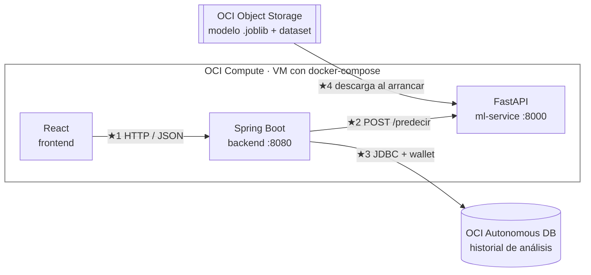
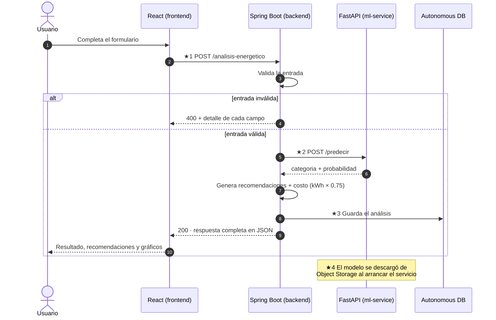

# 📋 EnergiAI — Propuesta Técnica (Obsoleta - 31/7/2026)

> 📎 **Anexo del [Informe Semana 1](../informe.md)** — propuesta del 21/07, ofrecida antes de la integración del Software Engineer al equipo. No es la versión final del stack que quedó, pero ayudó a establecerlo. Se preserva como snapshot de ese momento.

Esta es una propuesta para discutir en equipo. Nada de lo que sigue está decidido: cada elección viene con su justificación, para poder revisarla y ajustarla entre todos.

**Contenido:** interpretación del proyecto (§1) · stack tecnológico (§2) · arquitectura (§3) · estructura del código (§4) · contrato de API (§5) · integración (§6) · OCI (§7) · checklist de cumplimiento (§8). La propuesta de frontend se presentará por separado.

Leyenda usada en todo el documento:
📌 obligatorio según el enunciado · 📖 sugerido o preferido por el enunciado · 💡 propuesta propia · ⭐ extra opcional del enunciado

---

## 1. El proyecto en una frase

Una API REST que recibe los datos de consumo de un inmueble y devuelve, en una sola respuesta: su **clasificación energética** (Eficiente / Moderado / Ineficiente) con la probabilidad, **recomendaciones** para mejorar y el **costo mensual estimado** usando la tarifa de referencia de R$ 0,75 por kWh. El análisis lo hace un modelo de Machine Learning entrenado con un dataset propio, y la solución usa al menos un servicio de OCI.

### Cómo se interpreta el enunciado

El núcleo obligatorio funciona por **pedido y respuesta**: alguien envía los datos, el sistema los analiza y devuelve el resultado. No hay monitoreo automático en el MVP — la entrada es una foto del consumo mensual que se carga a mano, no un flujo de datos de un medidor. Dos señales del enunciado respaldan esta lectura: la funcionalidad obligatoria está definida como un endpoint con entrada y salida, y las "alertas de alto consumo" figuran entre los recursos *opcionales* (si el sistema debiera avisar solo, serían parte del núcleo).

La parte de "seguimiento a lo largo del tiempo" que menciona la necesidad del cliente se cubre con los opcionales: guardar el historial de análisis, comparar períodos y generar alertas.

---

## 2. Stack tecnológico propuesto

Agrupado por sector, con la justificación de cada elección.

### Ciencia de Datos / ML

| Propuesta | Por qué |
|---|---|
| Python + Pandas + Scikit-Learn 📖 | Indicado en el enunciado y estándar para Machine Learning con datos tabulares; documentación abundante e integración simple con el resto del sistema |
| Regresión Logística, Árbol de Decisión y Random Forest, comparados entre sí 📖 | Los tres modelos que recomienda el enunciado; rápidos de entrenar, fáciles de interpretar y suficientes para las 5 variables de entrada |
| Serialización del pipeline completo con joblib 💡 | Formato estándar de scikit-learn; guardar el pipeline entero (transformación de datos + modelo) evita duplicar el preprocesamiento en el servicio que lo usa |
| Servicio de inferencia con FastAPI 💡 | El modelo se ejecuta en el mismo lenguaje en el que se entrenó, sin conversiones; es un servicio mínimo, con un solo endpoint, fácil de probar y depurar |

### Backend

| Propuesta | Por qué |
|---|---|
| Java 17 + Spring Boot 3 📖 | Tecnología indicada como preferente en el enunciado, que trae resueltos de fábrica varios de los requisitos: validación de entrada, persistencia y documentación automática. Sobre las versiones: Spring Boot 3 es la línea vigente del framework (la 2 ya no recibe soporte) y exige como mínimo Java 17, que es versión LTS (soporte extendido); Java 21, también LTS, es igual de válida |
| springdoc-openapi 💡 | Genera el Swagger automáticamente a partir del código, por lo que la documentación siempre refleja los endpoints reales |
| Oracle Autonomous Database 💡 | Cubre la persistencia y, al ser un servicio de OCI, suma un servicio más al requisito de integración (detalle en §7). Alternativa: instalar una base como PostgreSQL o MySQL en la propia instancia — funciona igual, pero no contaría como servicio de OCI |

### Frontend

> Stack aún no cerrado al 100%: la definición completa del frontend (alcance, estética y manejo del acceso público) se tratará en una propuesta aparte.

| Propuesta | Por qué |
|---|---|
| React + Vite 💡 | Compila a archivos estáticos fáciles de alojar en cualquier lugar; entorno de desarrollo rápido y un ecosistema amplio de componentes y ejemplos |
| Recharts 💡 | Librería de gráficos hecha para React: los gráficos se escriben como componentes, igual que el resto de la interfaz |

### Infraestructura

| Propuesta | Por qué |
|---|---|
| Docker + docker-compose 💡 | Garantiza el mismo entorno en desarrollo y en el servidor; el despliegue completo queda en un solo comando y cada servicio corre aislado con sus dependencias |
| Git + GitHub 💡 | Revisión de cambios mediante Pull Requests y renderizado nativo de este documento, tablas y diagramas incluidos |
| Diagramas en Mermaid 💡 | Se escriben como texto dentro del Markdown, se versionan junto al código y GitHub los dibuja automáticamente |
| JUnit 5 (backend) y pytest (servicio de ML) 💡 | Cubre el opcional de pruebas automatizadas del enunciado; da confianza para integrar cambios sin romper lo que ya funciona |

---

## 3. Arquitectura propuesta

El sistema completo tiene **cuatro conexiones**, marcadas con ★. Si esas cuatro funcionan, el sistema funciona.



| ★ | Conexión | Cómo |
|---|---|---|
| ★1 | Frontend → Backend | Llamadas HTTP con JSON; un único archivo del front conoce la dirección del backend |
| ★2 | Backend → Servicio de ML | Spring Boot llama a `POST /predecir` y recibe solo categoría + probabilidad |
| ★3 | Backend → Base de datos | JPA/JDBC; en desarrollo local se usa una base en memoria y el cambio es pura configuración |
| ★4 | Object Storage → Servicio de ML | El servicio descarga el modelo al arrancar; si falla, usa una copia local del repo |

El frontend admite varias formas de alojamiento sin afectar al resto del sistema: dentro de la misma VM (archivos estáticos servidos junto al backend, como muestra el diagrama), en una instancia Micro gratuita dedicada, o en un servicio de hosting gratuito como Vercel o Netlify. La conexión ★1 es idéntica en todos los casos; solo cambia desde dónde se sirven los archivos. Único cuidado: si el frontend se aloja en un origen distinto al del backend, el backend debe habilitar CORS para ese origen (una línea de configuración en Spring Boot).

Idea detrás de ★2: el servicio de ML **solo predice**. Las recomendaciones y el cálculo del costo viven en Spring Boot como reglas de negocio — el propio enunciado indica que las recomendaciones pueden generarse "basadas en reglas o modelos", y la estimación financiera es aritmética (consumo × 0,75), sin modelo posible. Como evolución, el servicio de ML puede devolver además los factores que más pesaron en la clasificación, para que el backend elija recomendaciones más personalizadas (ver §5.6). Con esta separación, el modelo se puede reentrenar y reemplazar sin tocar la API pública.

### El viaje de un pedido de análisis



### Principio de configuración

Toda conexión se configura por **variable de entorno con un valor por defecto local**. En un entorno de desarrollo local el sistema corre sin configurar nada; en la VM, docker-compose inyecta los valores reales. Los secretos (contraseña de la base, wallet) nunca entran al repositorio.

---

## 4. Estructura del código propuesta

Un solo repositorio (monorepo) con una carpeta por componente. Cada carpeta se puede desarrollar y correr por separado, sin esperar a las demás.

```text
energiai/
├── README.md
├── docker-compose.yml            ← une todo el sistema
├── docs/                         ← documentación y los 3+ ejemplos obligatorios [OBLIGATORIO]
│
├── data-science/                 ← notebook entregable [OBLIGATORIO]
│   ├── notebooks/                   (generación de datos, EDA, entrenamiento)
│   ├── src/generador_dataset.py     (dataset propio con criterios documentados [OBLIGATORIO])
│   ├── data/consumo_energetico.csv
│   └── modelos/modelo_v1.joblib     (pipeline completo serializado [OBLIGATORIO])
│
├── ml-service/                   ← FastAPI: solo inferencia
│   ├── app/
│   │   ├── main.py                  ★2 POST /predecir
│   │   ├── modelo.py                ★4 descarga desde Object Storage + copia local
│   │   └── schemas.py               (validación de entrada/salida)
│   ├── requirements.txt
│   └── Dockerfile
│
├── backend/                      ← Spring Boot: la API pública [OBLIGATORIO]
│   ├── src/main/java/.../
│   │   ├── controller/              ★1 endpoints públicos
│   │   ├── dto/                     (validaciones de entrada)
│   │   ├── service/                 (orquestador · cliente de ML ★2 · recomendaciones · costos)
│   │   ├── model/ + repository/     ★3 entidad y acceso a la base
│   │   └── exception/               (manejo de errores con formato único)
│   ├── src/main/resources/application.yml   ← todas las conexiones se configuran acá
│   ├── pom.xml
│   └── Dockerfile
│
├── frontend/                     ← React + Vite
│   ├── src/
│   │   ├── api/cliente.js           ★1 único archivo que conoce al backend
│   │   ├── pages/                   (Análisis · Dashboard · Simulador)
│   │   └── components/
│   └── package.json
│
└── infra/                        ← OCI
    ├── scripts/subir_modelo.py      ★4 publica el modelo en Object Storage
    └── oci/                         (guías de bucket, VM y wallet)
```

Tres reglas transversales de la propuesta:

1. **Cada dirección externa la conoce un solo archivo** por componente (`cliente.js`, `MlClient.java`, `modelo.py`). Cambiar una URL es tocar un lugar, no buscar por todo el código.
2. **El preprocesamiento vive dentro del pipeline serializado.** El servicio de ML recibe el JSON crudo y el propio pipeline transforma los datos, sin lógica duplicada.
3. **Ningún secreto en el repositorio.** Contraseñas y credenciales van en `.env` y volúmenes, ambos ignorados por git.

---

## 5. Contrato de API propuesto

El contrato define los JSON exactos que entran y salen de cada endpoint, **antes** de escribir código. El beneficio es concreto: con el contrato fijado, frontend, backend y ML avanzan en paralelo usando datos falsos (mocks) sin esperarse entre sí, y la integración final es enchufar piezas que ya hablan el mismo idioma.

La regla propuesta: ningún cambio de campos o formatos sin actualizar este documento primero, mediante un PR que revisen las tres partes afectadas.

### 5.1 Convenciones

| Convención | Valor |
|---|---|
| Base URL | `https://<host>/api/v1` |
| Formato | JSON, campos en español y `snake_case` (siguiendo el enunciado) |
| Moneda | BRL, tarifa de referencia **R$ 0,75/kWh** 📌 |
| `categoria` | `"Eficiente"`, `"Moderado"` o `"Ineficiente"` 📌 |
| `tipo_inmueble` | `"Casa"`, `"Departamento"`, `"Oficina"` o `"Comercio"` 💡 (el enunciado solo muestra `"Casa"`; los demás valores son a definir) |
| `probabilidad` | Decimal entre `0.0` y `1.0` |

### 5.2 📌 `POST /analisis-energetico` — el endpoint central

**Entrada** (idéntica al ejemplo del enunciado):

```json
{
  "consumo_kwh": 420,
  "uso_horario_pico": true,
  "cantidad_equipos": 10,
  "tipo_inmueble": "Casa",
  "horas_alto_consumo": 8
}
```

**Validaciones** (la validación de entrada es 📌; los rangos concretos son 💡):

| Campo | Tipo | Regla |
|---|---|---|
| `consumo_kwh` | number | Requerido · mayor que 0 · hasta 20.000 |
| `uso_horario_pico` | boolean | Requerido |
| `cantidad_equipos` | integer | Requerido · entre 1 y 500 |
| `tipo_inmueble` | string | Requerido · uno de los valores permitidos |
| `horas_alto_consumo` | integer | Requerido · entre 0 y 24 |

**Salida `200 OK`:**

> 💡 **Decisión a discutir:** el enunciado muestra la clasificación, las recomendaciones y la estimación financiera como tres JSON separados. La propuesta es unificarlos en **una sola respuesta**, manteniendo los nombres de campo exactos del enunciado, para que un solo pedido resuelva el caso de uso completo. Los tres bloques del enunciado se leen como ejemplos ilustrativos de cada requisito, no como tres endpoints; la respuesta unificada contiene los campos literales de los tres. Si se prefiere apegarse a la letra, cada bloque puede exponerse además por separado (p. ej. `GET /analisis-energetico/{id}/recomendaciones`) casi sin costo, porque el análisis queda persistido.

```json
{
  "id_analisis": "a3f1c2e8-9b4d-4f6a-8c2e-1d5b7e9f0a3c",
  "fecha": "2026-07-15T14:32:00Z",
  "categoria": "Ineficiente",
  "probabilidad": 0.81,
  "recomendaciones": [
    "Reducir el uso de equipos durante horarios pico",
    "Evaluar aparatos con alto consumo energético",
    "Distribuir actividades de mayor consumo a lo largo del día"
  ],
  "costo_estimado_mensual": 315.00,
  "entrada": { "…eco de los datos analizados…" }
}
```

`categoria`, `probabilidad`, `recomendaciones` y `costo_estimado_mensual` son 📌. `id_analisis`, `fecha` y `entrada` son 💡: no cuestan nada ahora y habilitan la consulta posterior, el historial y la comparación entre períodos sin romper el contrato más adelante.

### 5.3 📌 `GET /analisis-energetico/{id_analisis}` — consulta de resultados

El enunciado exige un "endpoint para consulta de resultados". Devuelve un análisis previo por su ID, con el mismo cuerpo que el POST. Responde `404` si el ID no existe.

### 5.4 ⭐ Endpoints extra (opcionales del enunciado)

| Endpoint | Para qué |
|---|---|
| `GET /analisis-energetico?pagina=&desde=&hasta=` | Historial paginado — alimenta el dashboard y la comparación entre períodos |
| `POST /simulacion-ahorro` | Escenarios "¿qué pasa si…?": recibe un análisis base más cambios hipotéticos y devuelve la categoría simulada y el ahorro mensual/anual estimado |
| `POST /analisis-energetico/lote` | Carga masiva por CSV: responde `202` con un ID de lote y los resultados se consultan después |
| `GET /ranking` | Ranking de eficiencia de los análisis registrados |
| `GET /alertas?umbral_kwh=` | Análisis que superan un umbral de consumo |

### 5.5 Formato único de errores 💡 (el manejo de errores es 📌)

El enunciado exige manejar errores pero no define cómo. La propuesta: un solo formato para todos los errores de la API, con el detalle campo por campo cuando falla la validación.

```json
{
  "timestamp": "2026-07-15T14:32:00Z",
  "status": 400,
  "error": "VALIDACION",
  "mensaje": "La entrada contiene campos inválidos",
  "detalles": [
    { "campo": "consumo_kwh", "problema": "debe ser mayor que 0" }
  ]
}
```

| Código | Cuándo |
|---|---|
| `200` | Éxito |
| `202` | Lote CSV aceptado, en procesamiento ⭐ |
| `400` | Validación fallida |
| `404` | Análisis o lote no encontrado |
| `422` | JSON bien formado pero sin sentido semántico |
| `500` | Error interno (nunca mostrar el stack trace al cliente) |
| `503` | Servicio de ML no disponible |

### 5.6 💡 Contrato interno: backend ↔ servicio de ML

No se expone al público. `POST /predecir` recibe los mismos 5 campos de entrada y responde:

```json
{ "categoria": "Ineficiente", "probabilidad": 0.81, "version_modelo": "rf-v1" }
```

Las recomendaciones y el cálculo financiero **no** viven acá: son reglas de negocio del backend. El campo `version_modelo` deja rastro de qué modelo generó cada análisis, útil cuando se reentrene. Evolución opcional: agregar un campo `factores` con las variables que más pesaron en la clasificación (p. ej. `["uso_horario_pico", "horas_alto_consumo"]`), para que el backend seleccione recomendaciones personalizadas según lo que el modelo realmente detectó.

### 5.7 📌 Documentación

Swagger/OpenAPI en `/swagger-ui.html` desde el primer día, generado automáticamente desde el código (springdoc-openapi). Los **3 o más ejemplos reales de utilización** que exige el enunciado van en `docs/EJEMPLOS.md`, con pedido y respuesta reales: un caso Eficiente, uno Moderado y uno Ineficiente.

---

## 6. Integración: cómo se enciende todo

### 6.1 docker-compose (la esencia)

```yaml
services:
  ml-service:
    build: ./ml-service
    environment:
      OCI_BUCKET: energiai-modelos
      OCI_OBJETO_MODELO: modelo_v1.joblib

  backend:
    build: ./backend
    environment:
      ML_SERVICE_URL: http://ml-service:8000    # ★2 nombre del servicio = hostname
      DB_URL: jdbc:oracle:thin:@energiai_high?TNS_ADMIN=/app/wallet   # ★3
      DB_PASSWORD: ${DB_PASSWORD}               # viene de .env, fuera del repo
    depends_on: [ml-service]

  frontend:
    build: ./frontend
    environment:
      VITE_API_URL: http://<IP-VM>:8080/api/v1  # ★1
    depends_on: [backend]
```

### 6.2 Desarrollo sin bloqueos

Cada componente corre solo, con datos falsos donde haga falta:

| Componente | Corre con | Mientras tanto usa |
|---|---|---|
| Frontend | `npm run dev` | El backend con clasificador falso |
| Backend | `mvn spring-boot:run` | Base H2 en memoria + un cliente de ML falso que devuelve `("Ineficiente", 0.81)` |
| Servicio de ML | `uvicorn --reload` | La copia local del modelo (sin OCI) |
| Ciencia de datos | Jupyter | Nada — es el origen de los datos |

### 6.3 Orden de encendido de las conexiones reales

1. **★4** — el modelo real se publica en Object Storage y el servicio de ML lo descarga al arrancar.
2. **★2** — el backend reemplaza el cliente falso por la llamada real a `/predecir`.
3. **★3** — se cambia H2 por Autonomous DB (solo configuración, cero código).
4. **★1** — el frontend deja de apuntar a `localhost` y apunta a la VM.

Encender en este orden permite detectar cada falla en el eslabón exacto donde ocurre, en lugar de conectar todo junto y adivinar qué se rompió.

---

## 7. OCI

### 7.1 Contexto

No hay beneficios de OCI por participar de la simulación, por lo que el proyecto usa únicamente los recursos gratuitos ("free") de OCI. La cuenta disponible es Pay As You Go y pertenece al autor de esta propuesta, quien se encarga de su administración y del control de costos. Este tipo de cuenta tiene prioridad de capacidad para crear instancias Ampere A1 y sus recursos no se detienen por inactividad.

### 7.2 Qué servicio cumple cada rol

| Servicio de OCI | Rol en el proyecto | Franquicia gratuita |
|---|---|---|
| **Compute — Ampere A1 (ARM)** | La VM que corre el docker-compose completo | 3.000 OCPU-horas y 18.000 GB-horas por mes; el sistema completo usa una fracción |
| **Autonomous Database** | Historial de análisis (persistencia) | 2 bases de 20 GB cada una; la tabla de análisis pesa kilobytes |
| **Object Storage** | Modelo `.joblib` · dataset | 10 GB Standard + 10 GB de acceso infrecuente; el modelo pesa unos pocos MB |

Con estos tres servicios, el requisito de "al menos un servicio de OCI" queda triplicado. Si más adelante se agrega la alerta programada (opcional), **OCI Functions** sería el cuarto: tiene franquicia mensual gratuita de invocaciones y el uso de este proyecto sería mínimo.

### 7.3 Advertencias operativas

- **La VM es ARM.** Las imágenes Docker deben construirse para `linux/arm64`. Todo el stack propuesto tiene imagen oficial ARM; si se construyen desde una máquina x86, usar `docker buildx --platform linux/arm64` o construir directamente en la VM.
- **La base gratuita se detiene sola tras varios días sin actividad.** Verificar su estado antes de cada demo y, si quedó detenida, arrancarla desde la consola.

---

## 8. Checklist de cumplimiento contra el enunciado

Para verificar antes de la entrega, requisito por requisito:

| Requisito del enunciado | Cubierto por |
|---|---|
| Notebook: EDA, patrones, features, entrenamiento, métricas, recomendaciones, serialización | `data-science/notebooks/` |
| Dataset propio con criterios definidos y justificados | `generador_dataset.py` · criterios documentados en el notebook |
| Modelo entrenado y cargado correctamente | Pipeline serializado + carga en el servicio de ML (★4) |
| Endpoint de análisis del consumo | §5.2 `POST /analisis-energetico` |
| Endpoint de consulta de resultados | §5.3 `GET /analisis-energetico/{id}` |
| Clasificación + probabilidad en JSON | §5.2 salida |
| Recomendaciones | §5.2 salida (reglas en el backend) |
| Estimación financiera R$ 0,75/kWh | §5.2 `costo_estimado_mensual` |
| Validación de entrada | §5.2 tabla de validaciones |
| Manejo de errores | §5.5 formato único |
| API documentada | §5.7 Swagger |
| Integración con OCI (mínimo 1 servicio) | §7 — tres servicios |
| 3+ ejemplos reales de utilización | `docs/EJEMPLOS.md` |
| Arquitectura documentada | este documento (§3, §4, §6) |
