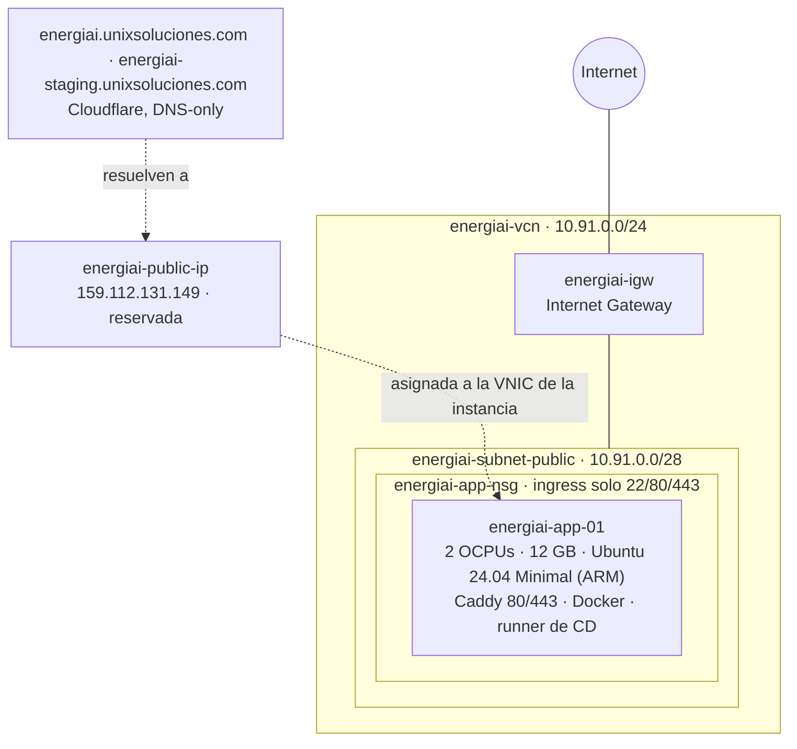
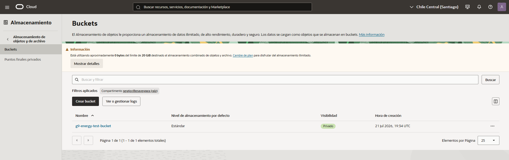
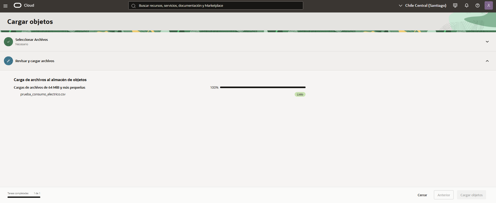
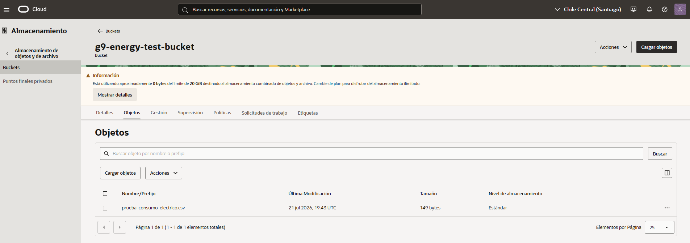
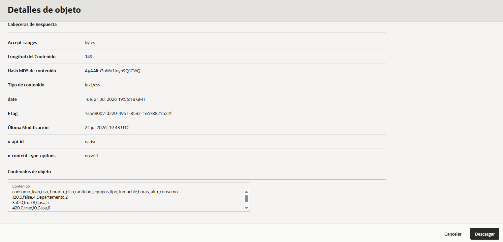
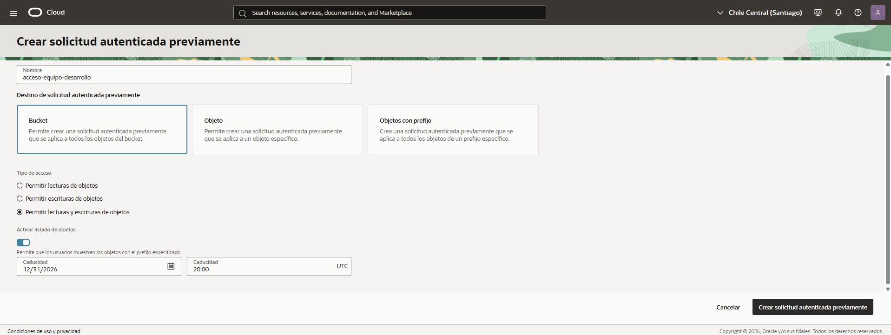
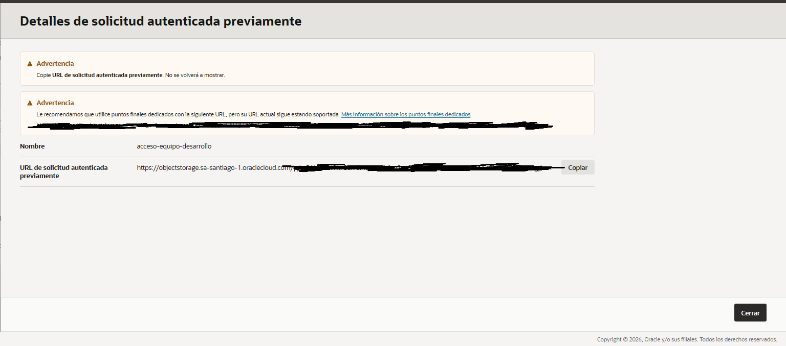
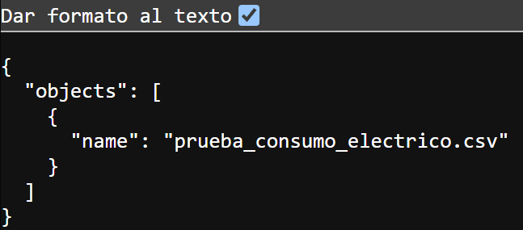

# ☁️ Documentación de Oracle Cloud Infrastructure (OCI)

## 📌 Resumen

El proyecto corre sobre **Oracle Cloud Infrastructure**: una VM Ampere (ARM64) aloja los dos ambientes completos de la aplicación — producción y staging, cada uno con su frontend y su API — detrás de un proxy inverso con HTTPS automático, y Object Storage ya cuenta con un bucket de prueba y acceso de equipo vía PAR. Esta página documenta la infraestructura completa: red, instancia, acceso, proxy, dominios, Object Storage, despliegue, seguridad y reconstrucción.

---

## 🛠️ Servicios OCI Utilizados

| Servicio OCI | Uso / Propósito | Estado |
|--------------|------------------|--------|
| **OCI Object Storage** | Almacenamiento del dataset de entrenamiento y modelo `.pkl` / `.onnx`. | 🟡 Bucket de prueba + acceso de equipo vía PAR (Sprint 2) — integración con la app pendiente |
| **OCI Compute** | Instancia de Máquina Virtual para el despliegue Docker en producción. | ✅ Infraestructura productiva desde el 27/07 (VM, HTTPS, runner de CD) — primer deploy de la app pendiente |

---

## 🗺️ Mapa general



| Recurso | Nombre | Dato clave |
|---------|--------|------------|
| Instancia | `energiai-app-01` | 2 OCPUs / 12 GB, ARM, usuario `ubuntu` |
| IP pública reservada | `energiai-public-ip` | **159.112.131.149** — la dirección definitiva del proyecto |
| VCN | `energiai-vcn` | Red privada `10.91.0.0/24` |
| Subnet pública | `energiai-subnet-public` | `10.91.0.0/28` |
| Internet Gateway | `energiai-igw` | Entrada y salida a internet de la VCN |
| NSG | `energiai-app-nsg` | Firewall de la VM, adjunto a su VNIC: ingress solo 22/80/443 |
| Dominios | `energiai.unixsoluciones.com` · `energiai-staging.unixsoluciones.com` | Registros A → 159.112.131.149 en Cloudflare, DNS-only, TTL 300 |

Todos los recursos del proyecto usan el prefijo `energiai-`. **La dirección `159.112.131.149` es fija**: al ser una IP reservada no cambia nunca, ni siquiera si la instancia se recrea.

---

## 🌐 Red y firewall

**Ruteo**: la route table de `energiai-vcn` tiene una única regla: `0.0.0.0/0 → energiai-igw`.

**Firewall — NSG `energiai-app-nsg`**: el firewall de la nube es un **Network Security Group adjunto a la VNIC** de la instancia (la práctica que recomienda Oracle). A diferencia de la security list — que aplica a toda la subnet y cualquier VM futura heredaría sus puertos abiertos — el NSG define reglas **por servidor** y sobrevive aunque la instancia se recree. Reglas actuales (todas stateful):

| Dirección | Origen / Destino | Protocolo | Puerto / Tipo | Uso |
|-----------|------------------|-----------|---------------|-----|
| Ingress | `0.0.0.0/0` | TCP | 22 | SSH |
| Ingress | `0.0.0.0/0` | TCP | 80 | HTTP — Caddy redirige a HTTPS |
| Ingress | `0.0.0.0/0` | TCP | 443 | HTTPS (Caddy) |
| Ingress | `0.0.0.0/0` | ICMP | tipo 3, código 4 | Path MTU discovery |
| Ingress | `10.91.0.0/24` | ICMP | tipo 3 | Diagnóstico dentro de la VCN |
| Egress | `0.0.0.0/0` | Todos | — | Salida sin restricciones (los NSG no traen egress por defecto: sin esta regla la VM no saldría a internet — runner, apt, Let's Encrypt) |

La **Default Security List** de la VCN quedó con el ingress **vacío** (conserva su egress "all"): el NSG es la única fuente de verdad del firewall. Como las reglas de NSG y security list se suman, la migración se hizo sin downtime: primero se adjuntó el NSG a la VNIC y recién después se vació la lista.

Los servicios de la aplicación (frontend, API, ml-service) **no exponen puertos propios a internet**: escuchan solo dentro de la VM y todo el tráfico entra por el proxy (80/443). **Verificado desde internet el 27/07**: 22, 80 y 443 responden; 8080, 8081 y puertos típicos de bases de datos, cerrados.

> ⚠️ **El NSG no es el único firewall.** Las imágenes de Ubuntu en OCI traen reglas de iptables propias dentro del SO que bloquean todo salvo el 22. Si un puerto está abierto en la nube pero no responde, el problema está adentro de la VM: hay que permitirlo también con iptables (insertando la regla antes del `REJECT` final de la chain INPUT) y persistirlo con `netfilter-persistent save`. Es el problema de conectividad más común en OCI.

---

## 🖥️ La instancia

| Atributo | Valor |
|----------|-------|
| Nombre | `energiai-app-01` |
| Shape | `VM.Standard.A1.Flex` (ARM Ampere Altra 3.0 GHz) |
| Recursos | 2 OCPUs · 12 GB RAM · red 2 Gbps |
| Imagen | `Canonical-Ubuntu-24.04-Minimal-aarch64-2026.04.30-1` |
| Boot volume | ~47 GB |
| IP privada | `10.91.0.6` |
| IP pública | `159.112.131.149` (reservada) |
| Usuario del SO | `ubuntu` |

**Por qué 2 OCPUs / 12 GB**: la instancia corre dos ambientes completos en paralelo — producción y staging, cada uno con su frontend, su backend y su servicio de ML — más el proxy que los expone. Los dos stacks juntos usan del orden de 4–6 GB de memoria, y el segundo core absorbe los builds de Docker durante los despliegues sin degradar los servicios en ejecución.

> ⚠️ **La VM es ARM64**: las imágenes Docker deben ser `linux/arm64`. Todo el stack del proyecto tiene imagen oficial ARM; la forma más simple de evitar problemas es construir las imágenes en la propia VM. Desde una máquina x86 se puede con `docker buildx --platform linux/arm64`. Si una imagen solo publica x86 (p. ej. algunas variantes Alpine), el build falla en el servidor aunque funcione en las PCs del equipo.

---

## 🔑 Acceso SSH

Modelo de acceso: **una clave por persona, nunca claves compartidas.**

1. Cada persona genera su propio par de claves en su máquina:

   Linux / macOS:

   ```bash
   ssh-keygen -t ed25519 -f ~/.ssh/energiai-app-01 -C "nombre@energiai"
   ```

   Windows (PowerShell):

   ```powershell
   ssh-keygen -t ed25519 -f $env:USERPROFILE\.ssh\energiai-app-01 -C "nombre@energiai"
   ```

2. Le pasa **solo la clave pública** (el archivo `.pub`) a quien gestione la VM, que la agrega al `authorized_keys`. La clave privada nunca sale de la máquina de su dueño.
3. Revocar un acceso = borrar su línea de `authorized_keys`. Los demás no se ven afectados.

Conexión: `ssh -i ~/.ssh/energiai-app-01 ubuntu@159.112.131.149`

En el Cloud Shell de OCI usar `-t rsa -b 4096` (su modo FIPS no permite Ed25519). En principio solo necesitan acceso quienes lleven la infraestructura: el resto del equipo interactúa con la VM a través de git y de las URLs públicas.

**Los secretos** (`.env` con contraseñas, wallet de base de datos) viven únicamente en la VM. No van al repositorio, no se imprimen en workflows y no se comparten por chat.

---

## 📦 Software en la VM (estado actual)

- **Docker Engine 29.6.2 + Compose v5.3.1** — el usuario `ubuntu` los usa sin sudo (grupo `docker`).
- **Caddy v2.11.4** — proxy inverso, instalado **nativo** (repo apt oficial, servicio systemd `caddy`). Detalle en la sección siguiente.
- **Runner de CD** — `energiai-oci-01`, registrado contra este repo (labels `self-hosted / Linux / ARM64 / oci`), servicio systemd `actions.runner.No-Country-simulation-G9-LATAM-TEAM-09.energiai-oci-01`, sobrevive reinicios. Los workflows de deploy están en propuesta al equipo.
- **`~/energiai-envs/`** — carpeta de secretos por ambiente (`.env.prod` / `.env.staging`, `chmod 600`): pendiente de crear antes del primer deploy. Sin ellos, los deploys fallan con un aviso claro, a propósito.

---

## 🔀 Proxy inverso y dominios (Caddy)

**Caddy** es el único punto de entrada público (80/443) y rutea por dominio a los dos ambientes. Tres razones para que exista:

1. Sin proxy **nada de la app es accesible desde afuera** (el NSG solo abre 22/80/443) — esta pieza es la que publica el proyecto.
2. **HTTPS automático**: Caddy emitió y renueva solo los certificados de Let's Encrypt (viven en `/var/lib/caddy`; no hace falta respaldarlos, se re-emiten solos).
3. **Todo queda testeable**: dominios directos a la API en ambos ambientes (Swagger, Postman), y con el frontend el patrón same-origin elimina CORS.

DNS en **Cloudflare** (modo **DNS-only** — el cliente llega directo a la VM y Caddy emite Let's Encrypt sin fricción), TTL 300:

| URL | Ambiente | Destino interno |
|-----|----------|-----------------|
| `https://energiai.unixsoluciones.com` | Producción | `localhost:8080` |
| `https://energiai-staging.unixsoluciones.com` | Staging | `localhost:8081` |

Configuración actual (`/etc/caddy/Caddyfile`):

```text
# Proxy inverso de EnergiAI en energiai-app-01 (VM OCI).
# HTTPS automático vía Let's Encrypt. Los backends los levanta el CD
# con docker compose: prod en :8080 y staging en :8081 (solo localhost
# a nivel firewall; 80/443 son los únicos puertos web públicos).

energiai.unixsoluciones.com {
	reverse_proxy localhost:8080
}

energiai-staging.unixsoluciones.com {
	reverse_proxy localhost:8081
}
```

**Por qué nativo y no en Docker**: los backends publican sus puertos solo en `127.0.0.1` de la VM, así que el proxy los alcanza por `localhost:puerto` sin redes compartidas ni aliases; systemd lo levanta al boot y apt lo actualiza con el resto del sistema; y queda **cero acoplamiento** con los proyectos compose de la app — un deploy roto jamás puede tirar el proxy.

**Con el frontend integrado**, el Caddyfile pasa al patrón **same-origin** — el front en la raíz del dominio y la API bajo `/api`, mismo origen, sin CORS para la app:

```text
energiai.unixsoluciones.com {
    handle /api/* {
        reverse_proxy localhost:8080
    }
    handle {
        reverse_proxy localhost:3000   # frontend prod (puerto según stack)
    }
}

energiai-staging.unixsoluciones.com {
    handle /api/* {
        reverse_proxy localhost:8081
    }
    handle {
        reverse_proxy localhost:3001   # frontend staging
    }
}
```

El backend ya sirve sus endpoints en `/api/v1/...`, así que el path pasa tal cual. Mientras el frontend esté en desarrollo, el dominio va directo a la API. Hasta el primer deploy los dominios responden **502 — es lo esperado**: el proxy está vivo, todavía no hay app detrás.

**URLs de testeo** (activas con el primer deploy; se muestran las de staging, producción es igual con su dominio):

- Swagger UI: `https://energiai-staging.unixsoluciones.com/swagger-ui/index.html` — el botón *Try it out* ejecuta requests reales desde el navegador.
- Spec OpenAPI: `https://energiai-staging.unixsoluciones.com/v3/api-docs` — se importa en Postman (Import → URL) y genera la colección completa.
- Endpoint real: `POST https://energiai-staging.unixsoluciones.com/api/v1/analisis-energetico`.
- Salud: `https://energiai-staging.unixsoluciones.com/actuator/health` — responde `{"status": "UP"}`; el detalle interno está restringido (`show-details=when-authorized`).

---

## 🚀 Despliegue

- Los dos ambientes conviven en la misma VM como **proyectos de Docker Compose separados** (`energiai-prod` / `energiai-staging`): contenedores, redes y volúmenes aislados por ambiente. Cada ambiente corre la aplicación completa — frontend, API y (cuando se integre) el ml-service.
- **La app no tiene carpeta propia en la VM — a propósito.** Cada deploy hace un checkout efímero del repo, construye las imágenes y levanta los contenedores; lo que corre vive en Docker, no en el checkout. La fuente de verdad es el repo en GitHub: la VM no acumula copias de código que puedan divergir.
- Los PRs desde forks requieren **aprobación manual** antes de ejecutar cualquier workflow — nada corre en la VM sin OK humano.

---

## 📦 Evidencia registrada — OCI Object Storage (Sprint 2)

| Campo | Valor |
|-------|-------|
| Bucket | `g9-energy-test-bucket` |
| Compartimento | `sergiovillenavergara (raíz)` |
| Región (consola) | Chile Central (Santiago) |
| Visibilidad | Privado |
| Nivel de almacenamiento | Estándar |
| Objeto de prueba | `prueba_consumo_electrico.csv` |
| Tamaño del objeto | 149 bytes |
| Content-Type | `text/csv` |
| Última modificación | 21 jul 2026, 19:43 UTC |

> No se registran credenciales, claves de API ni archivos de configuración de autenticación en esta documentación.

### Capturas

| Captura | Descripción |
|---------|-------------|
|  | Consola OCI → Buckets: bucket `g9-energy-test-bucket` creado en el compartimento raíz, región Chile Central (Santiago). |
|  | Carga del archivo de prueba `prueba_consumo_electrico.csv` al 100%, estado "Listo". |
|  | Pestaña "Objetos" del bucket mostrando el archivo cargado (149 bytes). |
|  | Detalles del objeto: cabeceras de respuesta (Content-Type, ETag, hash MD5) y vista previa del contenido CSV. |

---

## 🔗 Acceso de equipo — Pre-Authenticated Request (PAR)

Para dar acceso al bucket sin compartir credenciales individuales de OCI, se creó una **Pre-Authenticated Request (PAR)** — "solicitud autenticada previamente" en la consola en español.

| Campo | Valor |
|-------|-------|
| Nombre de la PAR | `acceso-equipo-desarrollo` |
| Destino | Bucket completo (`g9-energy-test-bucket`) |
| Tipo de acceso | Lectura y escritura de objetos |
| Listado de objetos | Activado |
| Caducidad | 31/12/2026, 20:00 UTC |

> ⚠️ La URL de la PAR funciona como credencial de acceso (bearer token) y **no se publica aquí ni en ninguna captura** — quien la necesite debe solicitarla directamente al integrante que la generó.

### Capturas

| Captura | Descripción |
|---------|-------------|
|  | Formulario "Crear solicitud autenticada previamente": destino Bucket, acceso de lectura/escritura, listado de objetos activado, caducidad 31/12/2026. |
|  | Detalles de la PAR creada (`acceso-equipo-desarrollo`); la URL fue tapada intencionalmente antes de guardar la captura. |
|  | Respuesta JSON al consultar la PAR, confirmando que el enlace lista correctamente el objeto `prueba_consumo_electrico.csv`. |

### Procedimiento reproducible (PAR)

1. En el bucket del proyecto, ir a **Solicitudes autenticadas previamente → Crear solicitud autenticada previamente**.
2. Definir un nombre descriptivo (ej. `acceso-equipo-desarrollo`), destino (Bucket / Objeto / Objetos con prefijo), tipo de acceso y fecha de caducidad.
3. Activar **listado de objetos** si el equipo necesita ver qué contiene el bucket a través del enlace.
4. Copiar la URL generada **una sola vez** (no se vuelve a mostrar) y compartirla por un canal seguro (nunca en el repositorio ni en capturas públicas).
5. Verificar que el enlace funciona consultándolo y confirmando que devuelve el listado/objeto esperado.

---

## 🔁 Procedimiento reproducible — Carga de objetos

Pasos para que cualquier integrante del equipo repita la prueba de Object Storage:

1. Ingresar a la consola de OCI con una cuenta con acceso al compartimento del proyecto.
2. Ir a **Almacenamiento → Almacenamiento de objetos y de archivo → Buckets**.
3. Verificar que exista el bucket `g9-energy-test-bucket` (o crear uno nuevo con **Crear bucket** si no existe).
4. Dentro del bucket, ir a la pestaña **Objetos** y usar **Cargar objetos** para subir un archivo de prueba.
5. Confirmar que el archivo aparece en la lista de **Objetos** con su tamaño y fecha de modificación.
6. Abrir el archivo y revisar **Detalles de objeto** para confirmar cabeceras (Content-Type, ETag) y contenido, sin exponer credenciales.
7. Adjuntar capturas de cada paso en `docs/oci-cloud/assets/` siguiendo la convención `NN-oci-object-storage-<descripcion>.png`.

---

## ✅ Resuelto en Sprint 2

- **Arquitectura de la instancia Compute confirmada como ARM** (no x86). Como consecuencia, se actualizaron las imágenes base del `Dockerfile` del backend a variantes multi-arquitectura (`maven:3.9-eclipse-temurin-17`, `eclipse-temurin:17-jre`) que sí publican `arm64`. Ver [`backend/Dockerfile`](../../backend/Dockerfile) y [`docs/backend/README.md`](../backend/README.md).
- **Acceso del equipo al bucket sin compartir credenciales de OCI**: resuelto mediante una Pre-Authenticated Request (PAR) — ver sección [Acceso de equipo — Pre-Authenticated Request (PAR)](#-acceso-de-equipo--pre-authenticated-request-par) arriba.
- **Acceso de consola/IAM a OCI definido y acotado**: el equipo decidió restringir el acceso directo a la consola de OCI (y a la instancia Compute de producción) a **Lautaro Mambrin** (Full Stack Developer, responsable de la instancia donde se despliega el proyecto) y **Sergio Villena** (Software Engineer, Arquitectura/DevOps). El resto del equipo accede al Object Storage mediante la PAR, sin necesidad de cuenta propia en la consola.

---

## 🧯 Reconstrucción de la VM (runbook)

Si la instancia se pierde o hay que recrearla, nada es irrecuperable — la IP reservada sobrevive y todo se reconstruye en ~20 minutos:

1. Crear la instancia nueva (mismo shape ARM, Ubuntu 24.04 Minimal) en la subnet pública y **asignarle la IP reservada** `159.112.131.149` — los dominios siguen funcionando sin tocar DNS.
2. **Adjuntar el NSG `energiai-app-nsg` a la VNIC nueva** — el NSG sobrevive a la instancia, pero como la security list quedó vacía de ingress, sin este paso no entra nada, ni siquiera SSH.
3. Restaurar las claves SSH del equipo en `authorized_keys` (cada quien re-manda su `.pub` si hace falta).
4. Abrir 80/443 en iptables y persistir con `netfilter-persistent save` (ver advertencia de la sección de red).
5. Instalar Docker con el script oficial de get.docker.com y sumar a `ubuntu` al grupo `docker`.
6. Instalar Caddy nativo (repo apt oficial) y restaurar `/etc/caddy/Caddyfile` — los certificados se re-emiten solos al primer arranque.
7. Registrar de nuevo el runner de CD (token en Settings → Actions → Runners del repo).
8. Recrear `~/energiai-envs/.env.prod` y `.env.staging` + el wallet desde el respaldo de claves (**pendiente**: definir ese respaldo).
9. Re-desplegar: botón *Re-run* en la última run de cada workflow de deploy (o mergear cualquier cambio).

**Pendiente: respaldo de claves/llaves.** Lo único que no se regenera solo: los valores de los `.env`, el wallet y el `Caddyfile`. La VM no puede ser el único lugar donde existan. Opcional: backup del boot volume desde la consola de OCI antes de cambios grandes.

---

## 🔐 Seguridad: estado y endurecimiento

**Lo que ya está:**

- Solo 22/80/443 abiertos a internet; los servicios internos no son alcanzables desde afuera (verificado 27/07).
- Firewall por **NSG adjunto a la VNIC**, con la security list vacía de ingress — migrado el 27/07 sin downtime.
- **HTTPS real** en los dos dominios (Let's Encrypt, renovación automática).
- SSH exclusivamente por clave (las imágenes de OCI deshabilitan el login por contraseña), una clave por persona. El 22 queda abierto al mundo — con IPs dinámicas en el equipo, restringir el origen genera lockouts; la clave es la barrera.
- **Workflows de forks bajo aprobación obligatoria** en GitHub Actions.
- Contenedores como usuario no-root (los Dockerfiles crean `appuser`).
- Doble barrera: NSG (nube) + iptables (SO).
- Los puertos que publica compose van solo a `127.0.0.1`: Docker puentea iptables en los puertos publicados, así que aunque un cambio de red los abriera por error, no hay nada escuchando hacia afuera.

**Endurecimiento opcional (orden valor/esfuerzo):** `fail2ban` contra fuerza bruta del 22; **OCI Bastion** (gratuito, cerraría el 22 público); verificar `unattended-upgrades` activo; **Cloud Guard** (gratuito, avisa de configuraciones expuestas a nivel cuenta).

---

## 📁 Mapa de carpetas en la VM

```text
/home/ubuntu/
├── energiai-runner/          runner de CD (servicio systemd)
│   └── _work/                checkouts efímeros de cada deploy
└── energiai-envs/            secretos por ambiente (chmod 600) — pendiente de crear
    ├── .env.prod
    ├── .env.staging
    └── wallet/               credenciales de base de datos (misma lógica: solo acá)

/etc/caddy/Caddyfile          config del proxy — Caddy corre NATIVO (systemd), no en Docker
/var/lib/caddy/               certificados TLS (los gestiona Caddy solo)
```

---

## 🖼️ Archivos y Capturas (`assets/`)
Guarde las capturas de la consola de OCI, configuración de buckets y red en `docs/oci-cloud/assets/`, siguiendo la convención `NN-oci-<servicio>-<descripcion>.png` usada arriba. Para procedimientos con varias capturas, agrupe en una subcarpeta kebab-case (ej. `assets/par-oci-object-storage/`). Los diagramas van embebidos en mermaid (GitHub los renderiza nativo).

---

## 🧠 Data Science + Object Storage

El microservicio `data-science/` (FastAPI en `data-science/Dockerfile`) consume y produce artefactos que viven en el bucket `g9-energy-test-bucket`:

| Objeto en el bucket | Productor | Consumidor |
|---|---|---|
| `data/database_beta.json` | `make pipeline` (CLI train) | `make test` (CLI validate), notebooks EDA |
| `data/modelo_eficiencia_v1.joblib` | `make pipeline` | API `/analisis-energetico` (al startup descarga) |
| `data/metricas_v1.joblib` | `make pipeline` | `make test` (verifica F1-score > 0) |

### Storage abstraction

`data-science/raw/infrastructure/storage/` define dos backends seleccionables vía env var:

| `STORAGE_BACKEND` | Backend | Uso |
|---|---|---|
| `local` (default) | `LocalStorage` (filesystem) | dev, CI, tests |
| `oci` | `OciBucketStorage` (oci-python-sdk) | prod en VM OCI |

```python
from infrastructure.storage import get_storage
storage = get_storage()  # elige según STORAGE_BACKEND
storage.upload("local_model.joblib", "data/modelo_eficiencia_v1.joblib")
storage.download("data/modelo_eficiencia_v1.joblib", "/tmp/modelo.joblib")
storage.exists("data/modelo.joblib")  # True/False
```

### Auth para `STORAGE_BACKEND=oci`

Orden de prioridad (definido en `OciBucketStorage._get_client()`):

1. **`OCI_INSTANCE_PRINCIPAL=true`** — recomendado en VM OCI Compute. Sin credenciales en disco. El SDK detecta automáticamente el OCID de la instancia vía IMDS.
2. **`OCI_CONFIG_FILE=/path/to/config`** — config tradicional de `~/.oci/config`. Útil desde CI runners o bastion.
3. **API key via env vars** — `OCI_USER_OCID`, `OCI_TENANCY_OCID`, `OCI_FINGERPRINT`, `OCI_PRIVATE_KEY_PATH` (o `OCI_PRIVATE_KEY_CONTENT`).

### Flujo end-to-end

```
1. data-scientist corre make pipeline localmente
   → STORAGE_BACKEND=local → artefactos en ./data-science/data/
   → opcionalmente con STORAGE_BACKEND=oci → sube al bucket

2. CI (data-science-ci en .github/workflows/ci.yml)
   → pytest 97 tests (storage mockeado, sin red)
   → docker build + smoke test /health
   → NO sube al bucket (no hay credenciales en CI)

3. Deploy a VM OCI (cd workflow)
   → docker compose up ml-service
   → STORAGE_BACKEND=oci + OCI_INSTANCE_PRINCIPAL=true
   → app.startup descarga modelo desde bucket al FS local
   → /analisis-energetico lee modelo local (cacheado)
```

### Variables de entorno requeridas

Ver `data-science/raw/.env.example` para referencia completa. Mínimo para bucket en prod:

```bash
STORAGE_BACKEND=oci
OCI_NAMESPACE=sergiovillenavergara
OCI_BUCKET=g9-energy-test-bucket
OCI_REGION=santiago-chile-1
OCI_INSTANCE_PRINCIPAL=true
```
